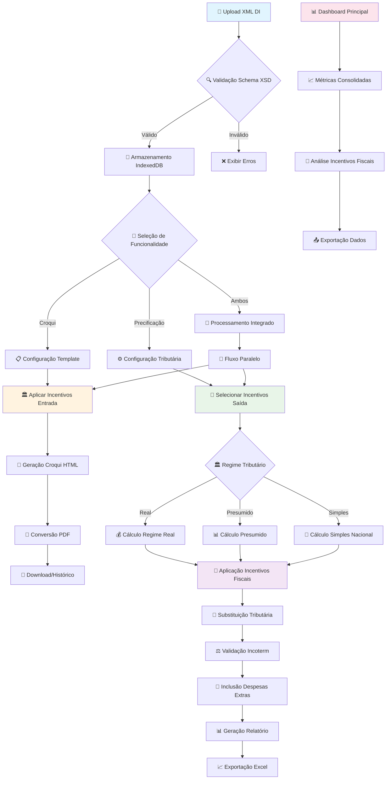
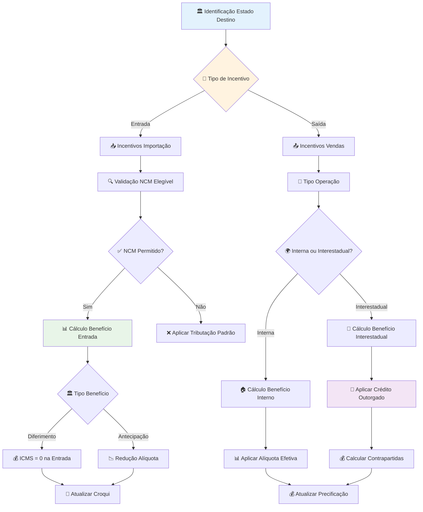

# Product Requirements Document v3
## Sistema Integrado de Gestão de Declarações de Importação

**Versão:** 3.0  
**Data:** setembro 2025  
**Responsável:** Professor Cecílio  

---

## 1. Visão Geral e Objetivos Estratégicos

### 1.1 Objetivo Principal

O Sistema Integrado de Gestão de Declarações de Importação (SIGDI) constitui uma plataforma web modular desenvolvida para automatizar e otimizar o processamento de dados fiscais e comerciais de empresas importadoras no Brasil. O sistema opera através da importação e análise de arquivos XML de Declarações de Importação, oferecendo duas funcionalidades centrais integradas:

1. **Geração automatizada de croquis** para notas fiscais de entrada
2. **Cálculo preciso de precificação** considerando múltiplos regimes tributários e incentivos fiscais

### 1.2 Inovação Fundamental: Sistema de Incentivos Fiscais

O SIGDI v3 introduz funcionalidade especializada para **incentivos fiscais estaduais**, estabelecendo clara distinção entre:

- **Incentivos de ENTRADA**: Aplicados na importação, afetando diretamente o croqui da nota fiscal
- **Incentivos de SAÍDA**: Aplicados nas vendas, impactando estratégias de precificação

Esta separação conceitual permite otimização fiscal completa, desde o desembaraço aduaneiro até a formação de preços de venda.

### 1.3 Aproveitamento de Base Tecnológica Existente

O desenvolvimento aproveita integralmente o sistema atual de alta qualidade (~70% dos requisitos já implementados), incluindo:
- DIProcessor.js (parser XML robusto)
- ExcelExporter.js (exportação profissional)
- ComplianceCalculator.js (base sólida para expansão)
- Sistema de storage e configurações

---

## 2. Funcionalidades Principais

### 2.1 Módulo de Importação e Processamento de Dados

#### RF-001 a RF-015: Processamento XML Avançado

**Características Mantidas:**
- Importação conforme esquema oficial Receita Federal
- Validação estrutural e semântica rigorosa
- Processamento batch para múltiplas DIs
- Feedback visual durante operações

**Expansões Implementadas:**
- Migração para IndexedDB com Dexie.js
- Suporte a 10.000+ DIs armazenadas
- Compressão automática de dados históricos
- Indexação otimizada para consultas complexas

#### Estrutura IndexedDB Especializada:
```javascript
const db = new Dexie('ExpertzyDB');
db.version(1).stores({
  // Entidades principais
  declaracoes: '++id, numero_di, importador.cnpj, data_processamento, *ncms, xml_hash',
  adicoes: '++id, di_id, numero_adicao, ncm, [di_id+numero_adicao]',
  produtos: '++id, adicao_id, codigo, descricao, ncm, valor_unitario',
  
  // Incentivos fiscais especializados
  incentivos_entrada: '++id, di_id, estado, tipo_beneficio, valor_economia',
  incentivos_saida: '++id, di_id, estado, operacao, credito_aplicado',
  
  // Business intelligence
  metricas_dashboard: '++id, periodo, tipo_metrica, valor, metadados',
  cenarios_precificacao: '++id, di_id, nome_cenario, configuracao, resultados',
  
  // Auditoria e controle
  historico_operacoes: '++id, timestamp, operacao, usuario, detalhes',
  snapshots: '++id, di_id, nome_customizado, timestamp, dados_completos'
});
```

### 2.2 Módulo de Geração de Croqui (RF-016 a RF-030)

#### Funcionalidades Expandidas:

**Geração Automatizada com Incentivos:**
- Mapeamento automático XML → Croqui
- **NOVO**: Aplicação de incentivos de entrada no croqui
- **NOVO**: Destaque de diferimentos e antecipações reduzidas
- Formatação padronizada profissional

**Exportação Dual:**
- **Excel** (mantido): ExcelJS com formatação profissional existente
- **PDF** (novo): jsPDF + html2canvas para conversão HTML→PDF

**Templates Configuráveis:**
- Layout personalizado por empresa
- Seções específicas para incentivos aplicados
- Cabeçalhos e rodapés informativos
- Metadados de auditoria

### 2.3 Sistema de Incentivos Fiscais (NOVO - RF-081 a RF-120)

#### RF-081: Engine de Incentivos de Entrada
**Estados Cobertos:**
- **Santa Catarina**: TTDs com antecipação reduzida (2,6% → 1,0% → 0,6%)
- **Minas Gerais**: Diferimento 100% na importação
- **Espírito Santo**: Diferimento INVEST-ES
- **Mato Grosso**: Diferimento total na entrada

**Implementação Técnica:**
```javascript
class EntryIncentiveEngine {
  applyEntryIncentives(estado, adicoes, ncms) {
    const incentivos = this.getEntryIncentives(estado);
    
    return adicoes.map(adicao => {
      const isElegible = this.validateEligibility(adicao.ncm, incentivos);
      
      if (isElegible) {
        switch(incentivos.tipo_beneficio) {
          case 'diferimento':
            return {...adicao, icms_entrada: 0, diferido: true};
          
          case 'antecipacao_reduzida':
            const novaBase = adicao.base_icms * incentivos.percentual_reducao;
            return {...adicao, icms_entrada: novaBase, incentivo_aplicado: incentivos.codigo};
        }
      }
      return adicao;
    });
  }
}
```

#### RF-082: Engine de Incentivos de Saída
**Estados Implementados:**
- **Goiás COMEXPRODUZIR**: 65% crédito outorgado + contrapartidas
- **Santa Catarina TTDs**: Alíquotas progressivas por fase
- **Rondônia**: 85% crédito presumido
- **Minas Gerais**: Crédito presumido 2,5-6%
- **Alagoas**: Compensação precatórios (até 90%)

**Cálculo Goiás Exemplo:**
```javascript
calculateGoiasComexproduzir(valorVenda, tipoOperacao, ncm) {
  if (this.isNCMVedado(ncm, 'GO')) return null;
  
  if (tipoOperacao === 'interestadual') {
    const creditoBase = valorVenda * 0.12 * 0.65; // 65% crédito
    const contrapartidas = creditoBase * 0.20; // 20% contrapartidas
    return {
      credito_outorgado: creditoBase,
      contrapartidas: {
        funproduzir: creditoBase * 0.05,
        protege: creditoBase * 0.15
      },
      carga_efetiva: 1.92
    };
  }
}
```

#### RF-083: Validação de Elegibilidade
**Critérios de Validação:**
- NCMs vedados por estado/incentivo
- Requisitos operacionais (perfil COMEX, faturamento)
- Contrapartidas obrigatórias
- Regras temporais (fases progressivas)

### 2.4 Módulo de Precificação Expandido (RF-031 a RF-060)

#### Três Regimes Tributários Completos:

**Regime Real (mantido e aperfeiçoado):**
- Cálculo integral de todos os tributos
- Aproveitamento total de créditos
- Integração com incentivos fiscais estaduais

**Regime Presumido (novo):**
```javascript
class PresumidoRegimeStrategy {
  calculate(adicao, config) {
    return {
      pis_cofins: this.calculateCumulativo(adicao.valor_cif),
      icms: this.calculateWithLimitedCredit(adicao),
      presumption_margin: this.applyPresumptionRules(adicao.ncm)
    };
  }
}
```

**Simples Nacional (novo):**
```javascript
class SimplesRegimeStrategy {
  calculate(adicao, config) {
    const faixa = this.determineFaixaFaturamento(config.faturamento_anual);
    return {
      icms_limited: this.applySimplesTax(adicao, faixa),
      restricted_credits: this.calculateRestrictedCredits(adicao)
    };
  }
}
```

#### RF-034: Reforma Tributária
**Novos Tributos:**
- **CBS** (Contribuição sobre Bens e Serviços)
- **IBS** (Imposto sobre Bens e Serviços)
- Cronograma de transição gradual
- Compatibilidade com sistema atual

#### RF-033: Substituição Tributária
```javascript
class STCalculationEngine {
  calculateICMSST(adicao, estado) {
    const mva = this.getMVA(adicao.ncm, estado);
    const baseSTSubstituto = adicao.valor_aduaneiro * (1 + mva);
    const icmsST = (baseSTSubstituto * this.getAliquota(estado)) - adicao.icms_proprio;
    return Math.max(icmsST, 0);
  }
}
```

### 2.5 Dashboard Analytics Avançado (RF-061 a RF-080)

#### Métricas Consolidadas:
- Total de DIs processadas por período
- Valor total importado com breakdown por estado
- **NOVO**: Economia total por incentivos fiscais
- Top 10 NCMs com maior benefício fiscal
- Performance comparativa entre regimes

#### Análises Drill-Down:
- Evolução temporal por NCM específico
- Distribuição geográfica de incentivos
- Comparativo de custos tributários
- Projeções de economia anual

#### Relatórios Gerenciais:
- Posição fiscal consolidada por estado
- Análise ROI por incentivo aplicado
- Sugestões de otimização fiscal
- Comparativo entre cenários de precificação

---

## 3. Arquitetura Técnica Detalhada

### 3.1 Stack Tecnológico

**Frontend Mantido:**
- HTML5 + CSS3 + JavaScript ES2020+
- Componentes modulares reutilizáveis
- Interface responsiva (Bootstrap 5)

**Bibliotecas Especializadas:**
- **Dexie.js**: Wrapper IndexedDB (NOVO)
- **ExcelJS**: Exportação Excel (mantido)
- **jsPDF + html2canvas**: Exportação PDF (NOVO)
- **Chart.js**: Visualizações dashboard (expandido)

**Build Tools:**
- **Vite**: Bundling e dev server
- **PostCSS**: Processamento CSS
- **ESLint + Prettier**: Qualidade código
- **Playwright**: Testes E2E (NOVO)

### 3.2 Arquitetura Modular

```
src/
├── modules/
│   ├── importacao/      # DIProcessor + validações (mantido)
│   ├── croqui/          # ExcelExporter + PDF (expandido)
│   ├── precificacao/    # 3 regimes + ST + Reforma (expandido)
│   ├── dashboard/       # Analytics completo (NOVO)
│   └── relatorios/      # Relatórios gerenciais (NOVO)
├── services/
│   ├── database/        # IndexedDBManager (NOVO)
│   ├── calculation/     # Engines especializados (expandido)
│   ├── incentives/      # Entry + Exit engines (NOVO)
│   ├── validation/      # Validadores NCM/Incoterm (expandido)
│   └── export/          # PDF + Excel managers (expandido)
```

### 3.3 Padrões Arquiteturais

#### Strategy Pattern para Regimes:
```javascript
class TributaryCalculationEngine {
  constructor() {
    this.strategies = {
      'real': new RealRegimeStrategy(),
      'presumido': new PresumidoRegimeStrategy(),
      'simples': new SimplesRegimeStrategy()
    };
    this.incentiveRules = new IncentiveRulesEngine();
  }
}
```

#### Observer Pattern para Estado:
```javascript
class AppStore {
  constructor() {
    this.state = {
      declaracoes: [],
      incentivos_aplicados: [],
      configuracao: {},
      ui: {}
    };
    this.observers = [];
  }
}
```

---

## 4. Workflow Completo do Sistema

### 4.1 Fluxo Principal Integrado



### 4.2 Workflow de Incentivos Fiscais



---

## 5. Implementação Faseada com Testes E2E

### Fase 1: Fundação e Migração (3 semanas)

#### Objetivos:
- Criar repositório GitHub expertzy-sistema-importacao
- Migrar código atual preservando qualidade
- Implementar IndexedDB com Dexie.js
- Configurar Playwright para testes E2E

#### Entregas:
- [ ] Repositório configurado com CI/CD GitHub Actions
- [ ] Código migrado para nova estrutura modular
- [ ] IndexedDBManager.js funcional com schema completo
- [ ] Suite básica de testes E2E configurada
- [ ] CLAUDE.md atualizado com padrões rigorosos

#### Testes E2E Obrigatórios:
```javascript
// playwright/tests/fase1-fundacao.spec.js
test('Migração localStorage para IndexedDB', async ({ page }) => {
  await page.goto('/');
  await page.uploadFile('samples/2300120746.xml');
  await page.expectDatabaseEntries('declaracoes', 1);
  await page.expectCleanLogs();
});

test('Performance IndexedDB vs localStorage', async ({ page }) => {
  await page.uploadMultipleDIs(10);
  await page.expectProcessingTime('<30s');
  await page.expectDatabaseSize('<100MB');
});
```

### Fase 2: Incentivos de Entrada (3 semanas)

#### Objetivos:
- Implementar EntryIncentiveEngine completo
- Integrar com ComplianceCalculator existente
- Atualizar geração de croqui com incentivos
- Validação automática por NCM/estado

#### Entregas:
- [ ] EntryIncentiveEngine.js com todos os estados
- [ ] Integração transparente ComplianceCalculator + incentivos
- [ ] Croqui NF mostrando incentivos aplicados
- [ ] Validação elegibilidade NCM automatizada

#### Testes E2E Obrigatórios:
```javascript
// playwright/tests/fase2-incentivos-entrada.spec.js
test('Santa Catarina TTD Antecipação', async ({ page }) => {
  await page.uploadDI('samples/di-sc-ttd.xml');
  await page.selectState('SC');
  await page.selectTTDFase('fase1');
  await page.expectICMSReduction(2.6);
  await page.generateCroqui();
  await page.expectCroquiSection('TTD 409 Fase 1 - 2,6%');
  await page.expectCleanLogs();
});

test('Minas Gerais Diferimento 100%', async ({ page }) => {
  await page.uploadDI('samples/di-mg-diferimento.xml');
  await page.selectState('MG');
  await page.expectICMSEntry(0);
  await page.expectDiferimentoFlag(true);
  await page.generateCroqui();
  await page.expectCroquiNote('ICMS diferido conforme legislação MG');
  await page.expectCleanLogs();
});

test('NCM Vedado Rejection', async ({ page }) => {
  await page.uploadDI('samples/di-ncm-vedado.xml');
  await page.selectState('GO');
  await page.expectIncentiveRejection('NCM 2710 vedado para COMEXPRODUZIR');
  await page.expectStandardTaxApplied();
  await page.expectCleanLogs();
});
```

### Fase 3: Incentivos de Saída (3 semanas)

#### Objetivos:
- Implementar ExitIncentiveEngine para todos os estados
- Integrar com PricingEngine existente
- Cálculos específicos Goiás COMEXPRODUZIR
- Otimização automática por estado/operação

#### Entregas:
- [ ] ExitIncentiveEngine.js completo (GO, SC, RO, MG, AL)
- [ ] Cálculos precisos com contrapartidas
- [ ] Otimização automática de estratégias fiscais
- [ ] Relatórios de economia fiscal detalhados

#### Testes E2E Obrigatórios:
```javascript
// playwright/tests/fase3-incentivos-saida.spec.js
test('Goiás COMEXPRODUZIR Interestadual', async ({ page }) => {
  await page.uploadDI('samples/di-go-elegivel.xml');
  await page.selectState('GO');
  await page.selectOperation('interestadual');
  await page.expectCreditoOutorgado(65);
  await page.expectContrapartida('funproduzir', 5);
  await page.expectContrapartida('protege', 15);
  await page.expectCargaEfetiva(1.92);
  await page.generatePricingReport();
  await page.expectEconomyCalculation();
  await page.expectCleanLogs();
});

test('Santa Catarina TTD Progressivo', async ({ page }) => {
  await page.uploadDI('samples/di-sc-ttd.xml');
  await page.selectState('SC');
  await page.selectTTDFase('fase2');
  await page.selectOperation('interna');
  await page.expectAliquotaEfetiva(1.0);
  await page.expectProgressiveCalculation();
  await page.expectCleanLogs();
});

test('Rondônia Crédito Presumido', async ({ page }) => {
  await page.uploadDI('samples/di-ro.xml');
  await page.selectState('RO');
  await page.expectCreditoPresumido(85);
  await page.expectCargaEfetiva(0.6);
  await page.expectCleanLogs();
});
```

### Fase 4: Dashboard e Analytics (3 semanas)

#### Objetivos:
- Dashboard completo com métricas de incentivos
- Analytics por NCM/estado/período
- Relatórios gerenciais exportáveis
- Sugestões de otimização fiscal

#### Entregas:
- [ ] Dashboard principal com métricas consolidadas
- [ ] Gráficos interativos Chart.js
- [ ] Análises drill-down por NCM
- [ ] Exportação relatórios PDF/Excel

#### Testes E2E Obrigatórios:
```javascript
// playwright/tests/fase4-dashboard.spec.js
test('Dashboard Métricas Incentivos', async ({ page }) => {
  await page.processMultipleDIs([
    'samples/di-go-comexproduzir.xml',
    'samples/di-sc-ttd.xml',
    'samples/di-mg-diferimento.xml'
  ]);
  
  await page.goto('/dashboard');
  await page.expectMetric('total-economy-incentives', '>0');
  await page.expectMetric('dis-with-entry-incentives', 2);
  await page.expectMetric('dis-with-exit-incentives', 3);
  await page.expectChart('economy-by-state');
  await page.expectChart('ncm-distribution');
  await page.expectCleanLogs();
});

test('Drill-down NCM Analysis', async ({ page }) => {
  await page.goto('/dashboard');
  await page.clickNCM('84181010');
  await page.expectNCMDetails('84181010');
  await page.expectIncentiveHistory();
  await page.expectOptimizationSuggestions();
  await page.expectStateComparison();
  await page.expectCleanLogs();
});

test('Relatório Economia Fiscal', async ({ page }) => {
  await page.goto('/dashboard/relatorios');
  await page.selectPeriod('last-12-months');
  await page.generateEconomyReport();
  await page.expectReportSections(['summary', 'by-state', 'by-ncm', 'projections']);
  await page.exportReportPDF();
  await page.expectCleanLogs();
});
```

### Fase 5: Regimes Tributários Expandidos (2 semanas)

#### Objetivos:
- Regime Presumido completo
- Simples Nacional implementado
- Substituição Tributária funcional
- Reforma Tributária preparada

#### Entregas:
- [ ] PresumidoRegimeStrategy.js funcional
- [ ] SimplesRegimeStrategy.js validado
- [ ] STCalculationEngine.js com MVA por estado
- [ ] ReformaTributariaEngine.js preparado

#### Testes E2E Obrigatórios:
```javascript
// playwright/tests/fase5-regimes.spec.js
test('Regime Presumido Cálculo', async ({ page }) => {
  await page.uploadDI('samples/di-presumido.xml');
  await page.selectRegime('presumido');
  await page.expectPISCOFINSCumulativo(true);
  await page.expectCreditoLimitado(true);
  await page.expectPresumptionMargin();
  await page.expectCalculationAccuracy();
  await page.expectCleanLogs();
});

test('Simples Nacional Limitações', async ({ page }) => {
  await page.uploadDI('samples/di-simples.xml');
  await page.selectRegime('simples');
  await page.expectFaixaFaturamento();
  await page.expectCreditoRestrito();
  await page.expectSimplesSpecificRules();
  await page.expectCleanLogs();
});

test('Substituição Tributária ST', async ({ page }) => {
  await page.uploadDI('samples/di-st-products.xml');
  await page.selectState('SP');
  await page.expectSTIdentification(true);
  await page.expectMVAApplication();
  await page.expectICMSSTCalculation();
  await page.expectAntecipatoryPayment();
  await page.expectCleanLogs();
});
```

### Fase 6: Validação Final e Deploy (2 semanas)

#### Objetivos:
- Testes integração end-to-end completos
- Performance optimization e benchmarks
- Documentação final usuário/desenvolvedor
- Deploy automatizado produção

#### Entregas:
- [ ] Suite completa 100+ testes E2E
- [ ] Performance benchmarks validados
- [ ] Documentação usuário completa
- [ ] Pipeline CI/CD deploy produção

#### Testes E2E Críticos:
```javascript
// playwright/tests/fase6-integracao.spec.js
test('Fluxo Completo Multi-Estado', async ({ page }) => {
  // Upload DIs de diferentes estados
  await page.uploadDIs([
    'samples/di-go-comexproduzir.xml',   // Goiás crédito saída
    'samples/di-sc-ttd-elegivel.xml',    // SC TTD entrada/saída
    'samples/di-mg-diferimento.xml',     // MG diferimento entrada
    'samples/di-ro-credito.xml',         // RO crédito presumido
    'samples/di-al-precatorio.xml'       // AL compensação
  ]);
  
  // Processar com incentivos automáticos
  await page.processAllWithIncentives();
  
  // Validar aplicação correta por estado
  await page.validateIncentivesByState();
  
  // Gerar relatórios consolidados
  await page.generateConsolidatedReports();
  
  // Exportar múltiplos formatos
  await page.exportExcel();
  await page.exportPDF();
  
  // Validar dashboard métricas
  await page.validateDashboardAccuracy();
  
  // Performance e logs limpos
  await page.expectProcessingTime('<30s');
  await page.expectMemoryUsage('<512MB');
  await page.expectCleanLogs();
  await page.expectNoErrors();
  await page.expectNoWarnings();
});

test('Stress Test Volume', async ({ page }) => {
  await page.uploadDIs(Array(100).fill('samples/di-template.xml'));
  await page.expectProcessingSuccess();
  await page.expectDatabaseIntegrity();
  await page.expectPerformanceMaintained();
  await page.expectCleanLogs();
});
```

---

## 6. Especificações Técnicas Avançadas

### 6.1 Sistema de Validações

#### Validator Engine Expandido:
```javascript
class IncentiveValidatorEngine {
  constructor() {
    this.rules = new Map();
    this.stateRules = new StateRulesEngine();
    this.ncmDatabase = new NCMDatabase();
  }
  
  validateIncentiveEligibility(di, estado, tipoIncentivo) {
    const validations = [
      this.validateNCMEligibility(di.ncms, estado, tipoIncentivo),
      this.validateOperationalRequirements(di.importador, estado),
      this.validateTemporalRequirements(di.data_importacao, estado),
      this.validateValueThresholds(di.valor_total, estado)
    ];
    
    return this.consolidateValidations(validations);
  }
}
```

### 6.2 Performance e Otimização

#### Estratégias de Cache:
```javascript
class CacheManager {
  constructor() {
    this.incentiveCache = new Map();
    this.calculationCache = new Map();
    this.ncmValidationCache = new Map();
  }
  
  cacheIncentiveRules(estado) {
    const key = `incentives_${estado}`;
    if (!this.incentiveCache.has(key)) {
      this.incentiveCache.set(key, this.loadStateIncentives(estado));
    }
    return this.incentiveCache.get(key);
  }
}
```

#### Web Workers para Processamento:
```javascript
// src/workers/incentive-calculator.worker.js
self.onmessage = function(e) {
  const { diData, estado, regime } = e.data;
  
  const incentiveEngine = new IncentiveCalculationEngine();
  const result = incentiveEngine.calculateAll(diData, estado, regime);
  
  self.postMessage(result);
};
```

---

## 7. Documentação e Controle de Qualidade

### 7.1 CLAUDE.md Especializado

#### Padrões Críticos Atualizados:
```markdown
# CLAUDE.md - Sistema Integrado com Incentivos Fiscais

## Padrões OBRIGATÓRIOS (CRÍTICOS)

### Zero Fallbacks Policy:
- NUNCA: `valor || 0`, `component || null`, `incentivo || {}`
- SEMPRE: Validação explícita + exceção clara
- EXEMPLO: `if (!incentivo) throw new Error('Incentivo ${estado} não encontrado')`

### Incentivos Fiscais (NOVO):
- ENTRADA: EntryIncentiveEngine integrado ao ComplianceCalculator
- SAÍDA: ExitIncentiveEngine integrado ao PricingEngine
- VALIDAÇÃO: NCMs vedados, requisitos operacionais OBRIGATÓRIOS

### Fluxo de Dados Incentivos:
1. XML → DIProcessor (parsing)
2. Estado identificado → Incentive eligibility validation
3. ENTRADA: ComplianceCalculator + EntryIncentiveEngine → Croqui
4. SAÍDA: PricingEngine + ExitIncentiveEngine → Precificação

### Engines Obrigatórios:
- EntryIncentiveEngine: SC TTDs, MG diferimento, ES INVEST-ES
- ExitIncentiveEngine: GO COMEXPRODUZIR, SC vendas, RO crédito
- IncentiveValidatorEngine: NCM validation, operational requirements

### Estados e Validações:
- Goiás: NCMs vedados (2710, 2711, 24.02, 22.03, 87.03)
- SC TTD: Fases progressivas (36 meses milestone)
- MG: Diferimento 100% entrada, crédito presumido saída
```

### 7.2 Testes E2E Arquivos XML

#### Arquivos Obrigatórios de Teste:
```
samples/
├── di-go-comexproduzir-elegivel.xml    # NCM permitido Goiás
├── di-go-ncm-vedado.xml                # NCM 2710 vedado
├── di-sc-ttd-fase1.xml                 # SC TTD primeiros 36 meses
├── di-sc-ttd-fase2.xml                 # SC TTD após 36 meses
├── di-mg-diferimento.xml               # MG diferimento 100%
├── di-es-invest.xml                    # ES INVEST-ES
├── di-ro-credito-presumido.xml         # RO 85% crédito
├── di-al-precatorio.xml                # AL compensação
├── di-regime-presumido.xml             # Teste regime presumido
├── di-simples-nacional.xml             # Teste simples nacional
├── di-st-products.xml                  # Produtos sujeitos ST
├── di-reforma-tributaria.xml           # Novos tributos CBS/IBS
└── di-multi-adicoes.xml                # Multiple additions stress test
```

---

## 8. Métricas de Sucesso e KPIs

### 8.1 Métricas Técnicas

#### Performance:
- **Processamento DI**: < 30 segundos (arquivo 10MB)
- **Cálculo incentivos**: < 5 segundos por estado
- **Geração relatórios**: < 15 segundos
- **Disponibilidade**: > 99% uptime

#### Qualidade:
- **Testes E2E**: 100% passando sem warnings
- **Cobertura código**: > 90% dos módulos críticos
- **Memory leaks**: Zero vazamentos detectados
- **Performance regression**: < 5% degradação entre releases

### 8.2 Métricas de Negócio

#### Economia Fiscal:
- **Identificação automática**: 100% incentivos aplicáveis
- **Economia média**: 15-90% por estado/incentivo
- **Precisão cálculos**: 99.5% compatibilidade com legislação
- **Tempo economia**: 75% redução vs processo manual

#### Adoção:
- **DIs processadas**: 100+ mensalmente no primeiro trimestre
- **Estados cobertos**: 5+ com incentivos específicos
- **NCMs validados**: 10.000+ classificações fiscais
- **Satisfação usuário**: NPS > 70

---

## 9. Considerações de Segurança e Compliance

### 9.1 Proteção de Dados Fiscais

#### Criptografia IndexedDB:
```javascript
class SecureStorage {
  constructor() {
    this.encryption = new AES256Encryption();
  }
  
  async saveSensitiveData(data) {
    const encrypted = await this.encryption.encrypt(JSON.stringify(data));
    return this.db.sensitiveData.add({
      id: data.id,
      encrypted_data: encrypted,
      hash: this.generateHash(data)
    });
  }
}
```

#### Auditoria Compliance:
```javascript
class ComplianceAuditor {
  logIncentiveApplication(di, incentivo, resultado) {
    this.auditLog.add({
      timestamp: new Date(),
      di_number: di.numero,
      incentivo_aplicado: incentivo.codigo,
      base_legal: incentivo.base_legal,
      economia_calculada: resultado.economia,
      hash_verificacao: this.generateVerificationHash(di, resultado)
    });
  }
}
```

### 9.2 Conformidade Regulatória

#### Versionamento Legislação:
- Histórico completo de mudanças tributárias
- Rastreabilidade de cálculos por data
- Validação automática contra normas vigentes
- Backup de regras fiscais por período

---

## 10. Roadmap Futuro e Expansões

### 10.1 Integrações Planejadas

#### APIs Governo:
- Receita Federal (consulta NCM atualizada)
- SEFAZ estaduais (validação incentivos)
- Banco Central (taxa câmbio oficial)
- MDIC (políticas comércio exterior)

#### ERPs Empresariais:
- SAP integration
- TOTVS connector
- Oracle EBS adapter
- Sistemas próprios via API REST

### 10.2 Funcionalidades Avançadas

#### Machine Learning:
- Predição de incentivos aplicáveis
- Otimização automática de rotas fiscais
- Análise preditiva de mudanças tributárias
- Recomendações personalizadas por perfil empresa

#### Blockchain:
- Auditoria imutável de cálculos
- Smart contracts para incentivos
- Rastreabilidade completa de operações
- Compliance automatizado

---

## 11. Conclusão

O Sistema Integrado de Gestão de Declarações de Importação v3 representa evolução significativa na automação e otimização fiscal para empresas importadoras brasileiras. A implementação faseada garante qualidade e estabilidade, enquanto o sistema de incentivos fiscais oferece diferencial competitivo único no mercado.

### Próximos Passos Imediatos:
1. ✅ Aprovação formal do PRD v3 pelos stakeholders
2. ✅ Configuração ambiente desenvolvimento colaborativo
3. ✅ Início Fase 1 - Fundação e Migração
4. ✅ Estabelecimento rotina follow-up semanal

### Compromisso de Qualidade:
- **Zero defeitos**: Cada fase só é concluída com testes E2E 100% passando
- **Performance garantida**: Benchmarks rigorosos em cada entrega
- **Documentação viva**: Atualização contínua conforme evolução
- **Feedback contínuo**: Iteração baseada em métricas reais de uso

**O sucesso do projeto será medido pela capacidade de gerar economia fiscal real e mensurável para as empresas usuárias, mantendo conformidade total com a complexa legislação tributária brasileira.**

---

*Este documento constitui a especificação oficial do Sistema Integrado de Gestão de Declarações de Importação v3 e serve como referência principal para todas as atividades de desenvolvimento, testes e implementação do projeto.*