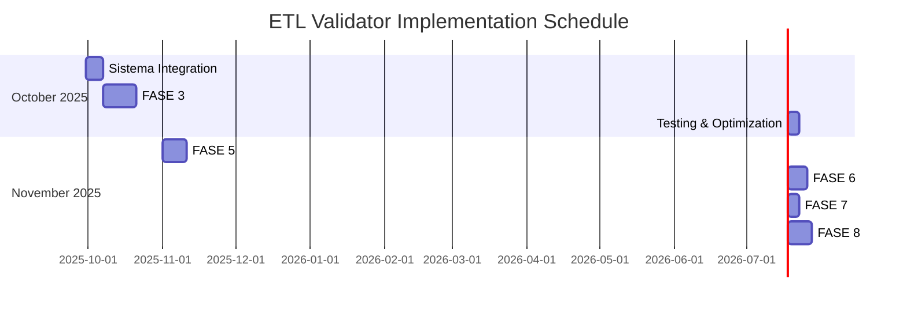

# 📋 ETL Validator - Follow-Up e Próximos Passos

**Plano de Implementação Pós-FASE 4**

---

## 🎯 SITUAÇÃO ATUAL (29/09/2025)

### ✅ O QUE JÁ ESTÁ PRONTO
- **FASE 1**: Estrutura base e hooks ✅
- **FASE 2**: Core validation modules ✅  
- **FASE 4**: Interface de visualização ✅

### ⏳ STATUS IMPLEMENTAÇÃO
```
ETL Validator System: 50% Complete
├── Backend Core: 70% ✅
├── Interface UI: 90% ✅  
├── Integration: 20% ⏳
└── Specialized Agents: 0% ⏳
```

---

## 🚀 PRÓXIMAS AÇÕES IMEDIATAS (Outubro 2025)

### 📅 SEMANA 1 (30/09 - 06/10)
**Foco**: Integração ao sistema principal

#### 1. Menu Principal Integration
- **Arquivo**: `index.html`
- **Ação**: Adicionar item "Validador ETL" entre Dashboard e Sobre
- **Ícone**: `bi-shield-check`
- **Estimativa**: 2h

#### 2. Brand Compliance Review
- **Arquivo**: `etl-theme.css`
- **Ação**: Ajustar cores para exata conformidade PDF
- **Cores**: #FF002D (red), #091A30 (navy), #FFFFFF (neutral)
- **Estimativa**: 3h

#### 3. Non-Intrusive Mode
- **Arquivo**: `ETLValidator.js`
- **Ação**: Implementar modo observador sem interrupção
- **Funcionalidade**: Logging + storage sem bloqueio
- **Estimativa**: 4h

#### 4. Database Schema Extension
- **Arquivo**: `IndexedDBManager.js`
- **Ação**: Adicionar tabela `etl_validations`
- **Campos**: di_id, timestamp, phase_results, quality_metrics
- **Estimativa**: 3h

### 📅 SEMANA 2 (07/10 - 13/10)
**Foco**: FASE 3 - Subagentes Especializados

#### 1. FiscalValidatorAgent
- **Arquivo**: `src/core/validators/agents/FiscalValidatorAgent.js`
- **Funcionalidades**:
  - Validação alíquotas por NCM/Estado
  - Verificação incentivos fiscais
  - Conformidade ICMS/IPI/PIS/COFINS
- **Estimativa**: 8h

#### 2. BusinessLogicValidatorAgent  
- **Arquivo**: `src/core/validators/agents/BusinessLogicValidatorAgent.js`
- **Funcionalidades**:
  - Validação INCOTERMS
  - Regras comerciais específicas
  - Consistência campos relacionados
- **Estimativa**: 6h

#### 3. DataIntegrityValidatorAgent
- **Arquivo**: `src/core/validators/agents/DataIntegrityValidatorAgent.js`
- **Funcionalidades**:
  - Integridade referencial
  - Detecção anomalias
  - Campos obrigatórios por contexto
- **Estimativa**: 6h

### 📅 SEMANA 3-4 (14/10 - 27/10)
**Foco**: ComplianceValidatorAgent + Integration

#### 1. ComplianceValidatorAgent
- **Arquivo**: `src/core/validators/agents/ComplianceValidatorAgent.js`
- **Funcionalidades**:
  - Conformidade regulatória
  - Documentos obrigatórios
  - Trilha de auditoria
- **Estimativa**: 8h

#### 2. Agent Integration Pattern
- **Strategy Pattern**: Registro dinâmico de agentes
- **Hook System**: Integração com ETLValidator
- **Event-driven**: Comunicação via eventos
- **Estimativa**: 6h

#### 3. Testing & Validation
- **Unit Tests**: Cobertura 95% agentes
- **Integration Tests**: Fluxo completo
- **Performance Tests**: < 500ms validação
- **Estimativa**: 10h

---

## 📊 CRONOGRAMA DETALHADO OUTUBRO-NOVEMBRO



### 🗓️ Marcos Importantes
| Data | Marco | Entrega |
|------|-------|---------|
| **06/10/2025** | Sistema Integration | ETL Validator no menu principal |
| **20/10/2025** | FASE 3 Complete | Subagentes especializados |
| **27/10/2025** | Testing Complete | Validação e otimização |
| **10/11/2025** | FASE 5 Complete | Sistema configuração |
| **20/11/2025** | FASE 6 Complete | Integração workflow |
| **30/11/2025** | **Production Ready** | **Sistema completo** |

---

## 🎯 RECURSOS E DEPENDÊNCIAS

### 👥 Recursos Necessários
- **Developer Time**: ~120 horas total
- **Testing Environment**: Configuração teste
- **Sample Data**: DIs representativas
- **Documentation**: Manuais técnicos e usuário

### 🔗 Dependências Críticas
1. **aliquotas.json**: Dados fiscais atualizados
2. **tributacao-monofasica.json**: Regras tributárias
3. **DIProcessor nomenclature**: Estabilidade nomes campos
4. **IndexedDB schema**: Compatibilidade backwards

### ⚠️ Riscos Identificados
| Risco | Probabilidade | Impacto | Mitigação |
|-------|---------------|---------|-----------|
| Performance degradation | Média | Alto | Async processing, caching |
| Data inconsistency | Baixa | Alto | Validation layers, rollback |
| Integration conflicts | Média | Médio | Staged deployment, testing |
| Regulatory changes | Alta | Médio | Configurable rules engine |

---

## 📈 MÉTRICAS DE PROGRESSO

### 🎯 KPIs Semanais
| Semana | Objetivo | Métrica | Alvo |
|--------|----------|---------|------|
| **W1** | Integration | Menu integration | 100% |
| **W2** | Agents | Fiscal + Business agents | 50% FASE 3 |  
| **W3** | Agents | Data + Compliance agents | 100% FASE 3 |
| **W4** | Testing | Unit + Integration tests | 95% coverage |

### 📊 Dashboard de Progresso
```
┌─────────────────────────────────────┐
│ ETL Validator Implementation Status │
├─────────────────────────────────────┤
│ ████████████████████░░░░  80% Week 1│
│ ████████████████░░░░░░░░  70% Week 2│
│ ████████████████████████  100% Week 3│
│ ████████████████████████  100% Week 4│
└─────────────────────────────────────┘
```

---

## 🚀 POST-IMPLEMENTATION ROADMAP

### 📅 Dezembro 2025 - Janeiro 2026
**Foco**: Otimização e expansão

#### 1. Advanced Analytics
- **Machine Learning**: Detecção padrões anomalias
- **Predictive Quality**: Previsão qualidade dados
- **Auto-correction**: Sugestões correção automática

#### 2. Mobile Interface
- **Progressive Web App**: Interface mobile
- **Push Notifications**: Alertas mobile
- **Offline Capability**: Funcionamento offline

#### 3. API Extension
- **REST API**: Acesso programático validações
- **Webhooks**: Notificações externas
- **Integration SDK**: SDK terceiros

### 📅 Fevereiro 2026 - Março 2026  
**Foco**: Enterprise features

#### 1. Multi-tenant Support
- **Organization Isolation**: Dados por organização
- **Custom Rules**: Regras por tenant
- **Role-based Access**: Controle acesso

#### 2. Advanced Reporting
- **Executive Dashboards**: KPIs executivos
- **Regulatory Reports**: Relatórios automáticos
- **Audit Trails**: Trilhas auditoria completas

#### 3. AI Integration
- **GPT-powered Analysis**: Análise textual
- **Natural Language Queries**: Consultas linguagem natural
- **Intelligent Suggestions**: Sugestões IA

---

## 📞 PONTOS DE DECISÃO

### 🔄 Review Points
1. **06/10/2025**: Go/No-Go FASE 3 implementation
2. **20/10/2025**: Performance validation checkpoint  
3. **01/11/2025**: User acceptance testing start
4. **15/11/2025**: Production deployment decision
5. **30/11/2025**: Success criteria evaluation

### 🎯 Success Criteria
- **Performance**: < 500ms validation time
- **Accuracy**: > 99% error detection
- **Usability**: < 5 clicks any workflow
- **Reliability**: 99.9% uptime
- **Adoption**: 100% team usage

---

## 🎉 VISÃO DE SUCESSO

### 🏆 End Goal - 30/11/2025
> "Sistema ETL Validator totalmente integrado, proporcionando visibilidade completa da qualidade dos dados, detecção proativa de problemas, e compliance fiscal automática, sem impactar a performance operacional."

### 💡 Value Proposition
- **Para Usuários**: Confiança total na qualidade dos dados
- **Para Negócio**: Zero erros fiscais, auditoria completa
- **Para TI**: Sistema self-healing, manutenção mínima
- **Para Compliance**: Evidências automáticas conformidade

---

*Documento gerado em: 29 de setembro de 2025*  
*Versão: 1.0 - Follow-up Plan*  
*Próxima revisão: 06 de outubro de 2025*