# PLANO DE IMPLEMENTAÇÃO FASEADA
## Sistema Integrado de Gestão de DI com Incentivos Fiscais

**Versão:** 1.0  
**Data:** setembro 2025  
**Responsável:** Professor Cecílio  

---

## 🎯 METODOLOGIA DE IMPLEMENTAÇÃO

### Critérios de Conclusão de Fase (OBRIGATÓRIOS)

**Cada fase só é considerada concluída quando:**
1. ✅ **100% dos testes E2E passando** com arquivos XML reais
2. ✅ **Logs completamente limpos** sem erros ou warnings
3. ✅ **Performance validada** conforme benchmarks especificados
4. ✅ **Code review aprovado** por 2+ desenvolvedores
5. ✅ **Documentação atualizada** para novas funcionalidades
6. ✅ **Rollback testado** em caso de problemas críticos

### Ferramenta de Validação: Playwright

**Configuração E2E Obrigatória:**
```javascript
// playwright.config.js
module.exports = {
  testDir: './playwright/tests',
  timeout: 60000,
  retries: 0, // Zero retries - testes devem passar na primeira tentativa
  use: {
    headless: true,
    screenshot: 'only-on-failure',
    video: 'retain-on-failure',
    trace: 'on-first-retry'
  },
  projects: [
    {
      name: 'fase1-fundacao',
      testMatch: 'fase1-*.spec.js'
    },
    {
      name: 'fase2-incentivos-entrada',
      testMatch: 'fase2-*.spec.js'
    },
    // ... configuração para cada fase
  ]
};
```

---

## 📋 FASE 1: FUNDAÇÃO E MIGRAÇÃO (3 semanas)

### 🎯 Objetivos Estratégicos
- Estabelecer base sólida preservando código de qualidade existente
- Migrar de localStorage para IndexedDB com Dexie.js
- Configurar ambiente de desenvolvimento colaborativo
- Implementar pipeline CI/CD com testes E2E

### 📦 Entregas Obrigatórias

#### Semana 1: Setup Repositório e CI/CD
- [ ] **Repositório GitHub**: `expertzy-sistema-importacao`
- [ ] **Estrutura Git Flow**: main/develop/feature branches
- [ ] **GitHub Actions**: Pipeline CI/CD configurado
- [ ] **Dependências**: Dexie.js, Playwright, Vite, ESLint
- [ ] **.gitignore**: Incluindo pasta `/uploads`

#### Semana 2: Migração Código e IndexedDB
- [ ] **Migração estrutural**: Código para nova arquitetura modular
- [ ] **IndexedDBManager.js**: Schema completo implementado
- [ ] **Migração dados**: Script localStorage → IndexedDB
- [ ] **CLAUDE.md**: Atualizado com padrões rigorosos

#### Semana 3: Testes E2E e Validação
- [ ] **Suite Playwright**: Configuração completa
- [ ] **Testes básicos**: Upload, parsing, storage
- [ ] **Performance**: Benchmarks estabelecidos
- [ ] **Rollback**: Estratégia de recuperação testada

### 🧪 Testes E2E Obrigatórios (Fase 1)

#### playwright/tests/fase1-fundacao.spec.js
```javascript
const { test, expect } = require('@playwright/test');

test.describe('Fase 1 - Fundação e Migração', () => {
  
  test('01 - Upload e parsing XML básico', async ({ page }) => {
    await page.goto('/');
    
    // Upload arquivo XML de teste
    const fileInput = page.locator('input[type="file"]');
    await fileInput.setInputFiles('samples/2300120746.xml');
    
    // Validar processamento
    await expect(page.locator('.processing-status')).toContainText('Processamento concluído');
    await expect(page.locator('.di-number')).toContainText('2300120746');
    
    // Verificar logs limpos
    const logs = await page.evaluate(() => console.logs || []);
    expect(logs.filter(log => log.level === 'error')).toHaveLength(0);
  });

  test('02 - Migração localStorage para IndexedDB', async ({ page }) => {
    await page.goto('/');
    
    // Simular dados existentes em localStorage
    await page.evaluate(() => {
      localStorage.setItem('expertzy_test_di', JSON.stringify({
        numero: 'TEST123',
        data: new Date().toISOString()
      }));
    });
    
    // Executar migração
    await page.click('[data-testid="migrate-data"]');
    
    // Validar dados em IndexedDB
    const dbData = await page.evaluate(async () => {
      const db = new Dexie('ExpertzyDB');
      db.version(1).stores({
        declaracoes: '++id, numero_di, data_processamento'
      });
      return await db.declaracoes.where('numero_di').equals('TEST123').first();
    });
    
    expect(dbData).toBeTruthy();
    expect(dbData.numero_di).toBe('TEST123');
  });

  test('03 - Performance IndexedDB vs localStorage', async ({ page }) => {
    await page.goto('/');
    
    // Carregar múltiplas DIs
    const uploadPromises = [];
    for (let i = 0; i < 10; i++) {
      uploadPromises.push(
        page.locator('input[type="file"]').setInputFiles(`samples/di-${i}.xml`)
      );
    }
    
    const startTime = Date.now();
    await Promise.all(uploadPromises);
    const endTime = Date.now();
    
    // Performance deve ser < 30 segundos
    expect(endTime - startTime).toBeLessThan(30000);
    
    // Validar todas as DIs foram salvas
    const diCount = await page.evaluate(async () => {
      const db = new Dexie('ExpertzyDB');
      db.version(1).stores({
        declaracoes: '++id, numero_di'
      });
      return await db.declaracoes.count();
    });
    
    expect(diCount).toBe(10);
  });

  test('04 - Validação logs limpos', async ({ page }) => {
    // Interceptar todos os logs
    const logs = [];
    page.on('console', msg => {
      logs.push({
        type: msg.type(),
        text: msg.text(),
        location: msg.location()
      });
    });
    
    await page.goto('/');
    await page.locator('input[type="file"]').setInputFiles('samples/2300120746.xml');
    await page.waitForSelector('.processing-complete');
    
    // Filtrar apenas erros e warnings
    const errors = logs.filter(log => log.type === 'error');
    const warnings = logs.filter(log => log.type === 'warning');
    
    // CRÍTICO: Zero erros ou warnings em operação normal
    expect(errors).toHaveLength(0);
    expect(warnings).toHaveLength(0);
  });

  test('05 - Rollback e recuperação', async ({ page }) => {
    await page.goto('/');
    
    // Simular falha na migração
    await page.evaluate(() => {
      // Corromper dados IndexedDB intencionalmente
      indexedDB.deleteDatabase('ExpertzyDB');
    });
    
    // Sistema deve detectar falha e fazer rollback
    await page.reload();
    await expect(page.locator('.rollback-message')).toBeVisible();
    
    // Dados localStorage devem estar preservados
    const localData = await page.evaluate(() => 
      Object.keys(localStorage).filter(key => key.startsWith('expertzy_'))
    );
    
    expect(localData.length).toBeGreaterThan(0);
  });

});
```

### 📊 Métricas de Sucesso (Fase 1)

| Métrica | Alvo | Validação |
|---------|------|-----------|
| Performance upload | < 30s por DI (10MB) | Playwright benchmark |
| Migração dados | 100% integridade | Comparação checksum |
| Logs limpos | 0 errors/warnings | Console monitoring |
| Cobertura IndexedDB | > 90% operações | Jest coverage |
| Memory leaks | Zero detectados | Chrome DevTools |

---

## 🏛️ FASE 2: INCENTIVOS DE ENTRADA (3 semanas)

### 🎯 Objetivos Estratégicos
- Implementar EntryIncentiveEngine completo
- Integrar com ComplianceCalculator existente
- Atualizar geração de croqui com incentivos aplicados
- Validação automática por NCM e estado

### 📦 Entregas Obrigatórias

#### Semana 1: EntryIncentiveEngine
- [ ] **EntryIncentiveEngine.js**: Implementação completa
- [ ] **Estados cobertos**: SC (TTDs), MG (diferimento), ES (INVEST-ES), MT
- [ ] **Validação NCM**: Sistema de elegibilidade por estado
- [ ] **Integração**: ComplianceCalculator + EntryIncentiveEngine

#### Semana 2: Atualização Croqui
- [ ] **ExcelExporter**: Seção incentivos no croqui
- [ ] **Formatação**: Destacar benefícios aplicados
- [ ] **PDF Export**: jsPDF + html2canvas implementado
- [ ] **Templates**: Layouts específicos por tipo de incentivo

#### Semana 3: Testes e Validação
- [ ] **Testes E2E**: Todos os estados e cenários
- [ ] **Validação NCM**: Teste com NCMs vedados/permitidos
- [ ] **Performance**: < 5 segundos por cálculo de incentivo
- [ ] **Integration**: Fluxo completo XML → Croqui com incentivos

### 🧪 Testes E2E Obrigatórios (Fase 2)

#### playwright/tests/fase2-incentivos-entrada.spec.js
```javascript
const { test, expect } = require('@playwright/test');

test.describe('Fase 2 - Incentivos de Entrada', () => {

  test('01 - Santa Catarina TTD Fase 1', async ({ page }) => {
    await page.goto('/');
    
    // Upload DI elegível para SC TTD
    await page.locator('input[type="file"]').setInputFiles('samples/di-sc-ttd-fase1.xml');
    await page.selectOption('[data-testid="estado-select"]', 'SC');
    await page.selectOption('[data-testid="ttd-fase"]', 'fase1');
    
    // Processar com incentivos
    await page.click('[data-testid="process-with-incentives"]');
    await page.waitForSelector('[data-testid="processing-complete"]');
    
    // Validar redução ICMS para 2,6%
    const icmsValue = await page.locator('[data-testid="icms-antecipacao"]').textContent();
    expect(icmsValue).toContain('2,6%');
    
    // Validar fundo educação 0,4%
    const fundoEducacao = await page.locator('[data-testid="fundo-educacao"]').textContent();
    expect(fundoEducacao).toContain('0,4%');
    
    // Gerar croqui e verificar incentivo destacado
    await page.click('[data-testid="generate-croqui"]');
    await page.waitForSelector('[data-testid="croqui-complete"]');
    
    const croquiContent = await page.locator('[data-testid="croqui-content"]').textContent();
    expect(croquiContent).toContain('TTD 409 Fase 1');
    expect(croquiContent).toContain('Antecipação reduzida: 2,6%');
    
    // Verificar logs limpos
    await expectCleanLogs(page);
  });

  test('02 - Minas Gerais Diferimento 100%', async ({ page }) => {
    await page.goto('/');
    
    // Upload DI para MG
    await page.locator('input[type="file"]').setInputFiles('samples/di-mg-diferimento.xml');
    await page.selectOption('[data-testid="estado-select"]', 'MG');
    
    // Processar diferimento
    await page.click('[data-testid="process-with-incentives"]');
    await page.waitForSelector('[data-testid="processing-complete"]');
    
    // Validar ICMS = 0 na entrada
    const icmsEntry = await page.locator('[data-testid="icms-entrada"]').textContent();
    expect(icmsEntry).toContain('R$ 0,00');
    
    // Validar flag diferimento
    const diferimentoFlag = await page.locator('[data-testid="diferimento-flag"]');
    await expect(diferimentoFlag).toBeVisible();
    await expect(diferimentoFlag).toContainText('Diferido 100%');
    
    // Gerar croqui com nota de diferimento
    await page.click('[data-testid="generate-croqui"]');
    const croquiContent = await page.locator('[data-testid="croqui-content"]').textContent();
    expect(croquiContent).toContain('ICMS diferido conforme legislação MG');
    
    await expectCleanLogs(page);
  });

  test('03 - NCM Vedado Goiás', async ({ page }) => {
    await page.goto('/');
    
    // Upload DI com NCM vedado (2710 - combustível)
    await page.locator('input[type="file"]').setInputFiles('samples/di-go-ncm-vedado.xml');
    await page.selectOption('[data-testid="estado-select"]', 'GO');
    
    // Tentar processar - deve rejeitar incentivo
    await page.click('[data-testid="process-with-incentives"]');
    
    // Validar rejeição
    const rejectionMessage = await page.locator('[data-testid="incentive-rejection"]');
    await expect(rejectionMessage).toBeVisible();
    await expect(rejectionMessage).toContainText('NCM 2710 vedado para COMEXPRODUZIR');
    
    // Validar que tributação padrão foi aplicada
    const standardTax = await page.locator('[data-testid="standard-tax-applied"]');
    await expect(standardTax).toBeVisible();
    
    await expectCleanLogs(page);
  });

  test('04 - Espírito Santo INVEST-ES', async ({ page }) => {
    await page.goto('/');
    
    // Upload DI elegível para ES
    await page.locator('input[type="file"]').setInputFiles('samples/di-es-invest.xml');
    await page.selectOption('[data-testid="estado-select"]', 'ES');
    
    // Processar INVEST-ES
    await page.click('[data-testid="process-with-incentives"]');
    await page.waitForSelector('[data-testid="processing-complete"]');
    
    // Validar diferimento INVEST-ES
    const investES = await page.locator('[data-testid="invest-es-diferimento"]');
    await expect(investES).toBeVisible();
    await expect(investES).toContainText('INVEST-ES: Diferimento 100%');
    
    // Validar ICMS = 0 na entrada
    const icmsValue = await page.locator('[data-testid="icms-entrada-value"]').textContent();
    expect(parseFloat(icmsValue.replace(/[^\d,]/g, '').replace(',', '.'))).toBe(0);
    
    await expectCleanLogs(page);
  });

  test('05 - Performance múltiplos incentivos', async ({ page }) => {
    await page.goto('/');
    
    const startTime = Date.now();
    
    // Processar múltiplas DIs com diferentes incentivos simultaneamente
    const diFiles = [
      'samples/di-sc-ttd.xml',
      'samples/di-mg-diferimento.xml',
      'samples/di-es-invest.xml',
      'samples/di-mt-diferimento.xml'
    ];
    
    for (const file of diFiles) {
      await page.locator('input[type="file"]').setInputFiles(file);
      await page.click('[data-testid="process-with-incentives"]');
      await page.waitForSelector('[data-testid="processing-complete"]');
    }
    
    const endTime = Date.now();
    
    // Performance total deve ser < 20 segundos para 4 DIs
    expect(endTime - startTime).toBeLessThan(20000);
    
    // Validar que todos os incentivos foram aplicados corretamente
    const processedDIs = await page.locator('[data-testid="processed-di"]').count();
    expect(processedDIs).toBe(4);
    
    await expectCleanLogs(page);
  });

  test('06 - Validação integração ComplianceCalculator', async ({ page }) => {
    await page.goto('/');
    
    // Upload DI e processar
    await page.locator('input[type="file"]').setInputFiles('samples/di-sc-ttd.xml');
    await page.selectOption('[data-testid="estado-select"]', 'SC');
    await page.click('[data-testid="process-with-incentives"]');
    
    // Validar que ComplianceCalculator recebeu dados com incentivos
    const calculationData = await page.evaluate(() => {
      return window.lastComplianceCalculation;
    });
    
    expect(calculationData.incentivos_aplicados).toBeTruthy();
    expect(calculationData.incentivos_aplicados.tipo).toBe('antecipacao_reduzida');
    expect(calculationData.incentivos_aplicados.percentual).toBe(2.6);
    
    // Validar que cálculos subsequentes usam valores com incentivo
    expect(calculationData.icms_base_incentivo).toBeLessThan(calculationData.icms_base_original);
    
    await expectCleanLogs(page);
  });

});

// Função auxiliar para validar logs limpos
async function expectCleanLogs(page) {
  const logs = await page.evaluate(() => {
    return window.testLogs || [];
  });
  
  const errors = logs.filter(log => log.level === 'error');
  const warnings = logs.filter(log => log.level === 'warn');
  
  expect(errors).toHaveLength(0);
  expect(warnings).toHaveLength(0);
}
```

### 📊 Métricas de Sucesso (Fase 2)

| Métrica | Alvo | Validação |
|---------|------|-----------|
| Cálculo incentivos | < 5s por estado | Playwright timing |
| NCMs validados | 100% elegibilidade correta | Matriz de teste |
| Integração ComplianceCalculator | Zero regressões | Suite regressão |
| Croqui com incentivos | 100% dados corretos | Validação visual |
| Estados cobertos | SC, MG, ES, MT | Testes específicos |

---

## 💰 FASE 3: INCENTIVOS DE SAÍDA (3 semanas)

### 🎯 Objetivos Estratégicos
- Implementar ExitIncentiveEngine para todos os estados
- Integrar com PricingEngine para otimização estratégias
- Cálculos específicos Goiás COMEXPRODUZIR com contrapartidas
- Sistema de otimização automática por estado/operação

### 📦 Entregas Obrigatórias

#### Semana 1: ExitIncentiveEngine
- [ ] **ExitIncentiveEngine.js**: Estados GO, SC, RO, MG, AL
- [ ] **Goiás COMEXPRODUZIR**: Cálculo completo com contrapartidas
- [ ] **Santa Catarina TTDs**: Alíquotas progressivas vendas
- [ ] **Validação operações**: Interna vs interestadual

#### Semana 2: Integração PricingEngine
- [ ] **PricingEngine**: Integração ExitIncentiveEngine
- [ ] **Otimização**: Sugestões automáticas melhor estado
- [ ] **Contrapartidas**: Cálculo FUNPRODUZIR, PROTEGE
- [ ] **Relatórios**: Economia fiscal detalhada

#### Semana 3: Testes e Validação
- [ ] **Testes E2E**: Cenários complexos multi-estado
- [ ] **Performance**: < 10s para otimização completa
- [ ] **Precisão**: 99.5% conformidade legislação
- [ ] **Integration**: Dashboard métricas economia

### 🧪 Testes E2E Obrigatórios (Fase 3)

#### playwright/tests/fase3-incentivos-saida.spec.js
```javascript
const { test, expect } = require('@playwright/test');

test.describe('Fase 3 - Incentivos de Saída', () => {

  test('01 - Goiás COMEXPRODUZIR Interestadual', async ({ page }) => {
    await page.goto('/');
    
    // Upload DI elegível para Goiás
    await page.locator('input[type="file"]').setInputFiles('samples/di-go-elegivel.xml');
    await page.selectOption('[data-testid="estado-select"]', 'GO');
    await page.selectOption('[data-testid="operacao-tipo"]', 'interestadual');
    
    // Configurar valor de venda
    await page.fill('[data-testid="valor-venda"]', '100000');
    
    // Calcular incentivos de saída
    await page.click('[data-testid="calculate-exit-incentives"]');
    await page.waitForSelector('[data-testid="calculation-complete"]');
    
    // Validar crédito outorgado 65%
    const creditoOutorgado = await page.locator('[data-testid="credito-outorgado"]').textContent();
    expect(creditoOutorgado).toContain('65%');
    
    // Validar contrapartidas
    const funproduzir = await page.locator('[data-testid="contrapartida-funproduzir"]').textContent();
    const protege = await page.locator('[data-testid="contrapartida-protege"]').textContent();
    expect(funproduzir).toContain('5%');
    expect(protege).toContain('15%');
    
    // Validar carga efetiva 1,92%
    const cargaEfetiva = await page.locator('[data-testid="carga-efetiva"]').textContent();
    expect(cargaEfetiva).toContain('1,92%');
    
    // Gerar relatório de economia
    await page.click('[data-testid="generate-economy-report"]');
    const economyValue = await page.locator('[data-testid="economy-value"]').textContent();
    expect(parseFloat(economyValue.replace(/[^\d,]/g, '').replace(',', '.'))).toBeGreaterThan(0);
    
    await expectCleanLogs(page);
  });

  test('02 - Goiás COMEXPRODUZIR Interno', async ({ page }) => {
    await page.goto('/');
    
    await page.locator('input[type="file"]').setInputFiles('samples/di-go-elegivel.xml');
    await page.selectOption('[data-testid="estado-select"]', 'GO');
    await page.selectOption('[data-testid="operacao-tipo"]', 'interna');
    await page.fill('[data-testid="valor-venda"]', '100000');
    
    await page.click('[data-testid="calculate-exit-incentives"]');
    await page.waitForSelector('[data-testid="calculation-complete"]');
    
    // Validar redução de base para carga efetiva 4%
    const baseReduzida = await page.locator('[data-testid="base-reduzida"]').textContent();
    expect(baseReduzida).toContain('78,95%');
    
    const cargaEfetiva = await page.locator('[data-testid="carga-efetiva"]').textContent();
    expect(cargaEfetiva).toContain('4,00%');
    
    await expectCleanLogs(page);
  });

  test('03 - Santa Catarina TTD Vendas', async ({ page }) => {
    await page.goto('/');
    
    await page.locator('input[type="file"]').setInputFiles('samples/di-sc-ttd.xml');
    await page.selectOption('[data-testid="estado-select"]', 'SC');
    await page.selectOption('[data-testid="ttd-fase"]', 'fase2');
    await page.selectOption('[data-testid="operacao-tipo"]', 'interestadual');
    await page.fill('[data-testid="valor-venda"]', '100000');
    
    await page.click('[data-testid="calculate-exit-incentives"]');
    await page.waitForSelector('[data-testid="calculation-complete"]');
    
    // Validar alíquota efetiva fase 2 (1,0%)
    const aliquotaEfetiva = await page.locator('[data-testid="aliquota-efetiva"]').textContent();
    expect(aliquotaEfetiva).toContain('1,0%');
    
    // Validar cálculo progressivo
    const calculoProgressivo = await page.locator('[data-testid="calculo-progressivo"]');
    await expect(calculoProgressivo).toBeVisible();
    await expect(calculoProgressivo).toContainText('TTD 409 Fase 2');
    
    await expectCleanLogs(page);
  });

  test('04 - Rondônia Crédito Presumido', async ({ page }) => {
    await page.goto('/');
    
    await page.locator('input[type="file"]').setInputFiles('samples/di-ro-credito.xml');
    await page.selectOption('[data-testid="estado-select"]', 'RO');
    await page.fill('[data-testid="valor-venda"]', '100000');
    
    await page.click('[data-testid="calculate-exit-incentives"]');
    await page.waitForSelector('[data-testid="calculation-complete"]');
    
    // Validar 85% crédito presumido
    const creditoPresumido = await page.locator('[data-testid="credito-presumido"]').textContent();
    expect(creditoPresumido).toContain('85%');
    
    // Validar carga efetiva 0,6%
    const cargaEfetiva = await page.locator('[data-testid="carga-efetiva"]').textContent();
    expect(cargaEfetiva).toContain('0,6%');
    
    await expectCleanLogs(page);
  });

  test('05 - Alagoas Compensação Precatórios', async ({ page }) => {
    await page.goto('/');
    
    await page.locator('input[type="file"]').setInputFiles('samples/di-al-precatorio.xml');
    await page.selectOption('[data-testid="estado-select"]', 'AL');
    await page.fill('[data-testid="valor-venda"]', '100000');
    
    await page.click('[data-testid="calculate-exit-incentives"]');
    await page.waitForSelector('[data-testid="calculation-complete"]');
    
    // Validar compensação até 90%
    const compensacao = await page.locator('[data-testid="compensacao-precatorio"]').textContent();
    expect(compensacao).toContain('90%');
    
    const economiaTotal = await page.locator('[data-testid="economia-total"]').textContent();
    const economiaValue = parseFloat(economiaTotal.replace(/[^\d,]/g, '').replace(',', '.'));
    expect(economiaValue).toBeGreaterThan(80); // Economia > 80% do ICMS
    
    await expectCleanLogs(page);
  });

  test('06 - Otimização Multi-Estado', async ({ page }) => {
    await page.goto('/');
    
    // Upload DI com múltiplos produtos
    await page.locator('input[type="file"]').setInputFiles('samples/di-multi-produtos.xml');
    await page.fill('[data-testid="valor-venda-total"]', '500000');
    
    // Executar otimização automática
    await page.click('[data-testid="optimize-multi-state"]');
    await page.waitForSelector('[data-testid="optimization-complete"]');
    
    // Validar sugestões por estado
    const sugestoes = await page.locator('[data-testid="optimization-suggestions"]').textContent();
    expect(sugestoes).toContain('GO: Melhor para operações interestaduais');
    expect(sugestoes).toContain('SC: Progressivo para longo prazo');
    expect(sugestoes).toContain('RO: Menor carga tributária geral');
    
    // Validar ranking de estados
    const ranking = await page.locator('[data-testid="state-ranking"] .rank-item');
    expect(await ranking.count()).toBeGreaterThan(3);
    
    await expectCleanLogs(page);
  });

  test('07 - Performance otimização complexa', async ({ page }) => {
    await page.goto('/');
    
    const startTime = Date.now();
    
    // Processar cenário complexo com 5 estados simultaneamente
    await page.locator('input[type="file"]').setInputFiles('samples/di-complex-scenario.xml');
    
    // Testar todos os estados
    const estados = ['GO', 'SC', 'RO', 'MG', 'AL'];
    for (const estado of estados) {
      await page.selectOption('[data-testid="estado-select"]', estado);
      await page.click('[data-testid="calculate-exit-incentives"]');
      await page.waitForSelector('[data-testid="calculation-complete"]');
    }
    
    const endTime = Date.now();
    
    // Performance total deve ser < 30 segundos para 5 estados
    expect(endTime - startTime).toBeLessThan(30000);
    
    // Validar que todos os cálculos foram salvos
    const calculationHistory = await page.locator('[data-testid="calculation-history"] .calculation-item');
    expect(await calculationHistory.count()).toBe(5);
    
    await expectCleanLogs(page);
  });

  test('08 - Integração PricingEngine', async ({ page }) => {
    await page.goto('/');
    
    await page.locator('input[type="file"]').setInputFiles('samples/di-go-elegivel.xml');
    await page.selectOption('[data-testid="estado-select"]', 'GO');
    await page.fill('[data-testid="valor-venda"]', '100000');
    
    await page.click('[data-testid="calculate-with-pricing-engine"]');
    await page.waitForSelector('[data-testid="pricing-complete"]');
    
    // Validar integração com PricingEngine
    const pricingData = await page.evaluate(() => {
      return window.lastPricingCalculation;
    });
    
    expect(pricingData.exit_incentives).toBeTruthy();
    expect(pricingData.optimization_suggestions).toBeTruthy();
    expect(pricingData.fiscal_economy).toBeGreaterThan(0);
    
    // Validar que dados foram persistidos no IndexedDB
    const dbData = await page.evaluate(async () => {
      const db = new Dexie('ExpertzyDB');
      db.version(1).stores({
        incentivos_saida: '++id, di_id, estado, credito_aplicado'
      });
      return await db.incentivos_saida.orderBy('id').last();
    });
    
    expect(dbData.estado).toBe('GO');
    expect(dbData.credito_aplicado).toBeGreaterThan(0);
    
    await expectCleanLogs(page);
  });

});
```

### 📊 Métricas de Sucesso (Fase 3)

| Métrica | Alvo | Validação |
|---------|------|-----------|
| Cálculo incentivos saída | < 10s otimização completa | Playwright timing |
| Precisão Goiás COMEXPRODUZIR | 100% conformidade legislação | Validação manual |
| Estados cobertos saída | GO, SC, RO, MG, AL | Testes específicos |
| Economia fiscal calculada | > 15% média por incentivo | Métricas dashboard |
| Performance multi-estado | < 30s para 5 estados | Stress test |

---

## 📊 FASE 4: DASHBOARD E ANALYTICS (3 semanas)

### 🎯 Objetivos Estratégicos
- Dashboard completo com métricas de incentivos fiscais
- Analytics por NCM, estado e período temporal
- Relatórios gerenciais exportáveis PDF/Excel
- Sistema de sugestões de otimização fiscal

### 📦 Entregas Obrigatórias

#### Semana 1: Dashboard Principal
- [ ] **MetricsEngine.js**: Cálculo KPIs consolidados
- [ ] **ChartManager.js**: Gráficos interativos Chart.js
- [ ] **Dashboard interface**: Cards métricas + visualizações
- [ ] **Real-time updates**: Atualização automática dados

#### Semana 2: Analytics Avançados
- [ ] **NCMAnalysis.js**: Drill-down por classificação fiscal
- [ ] **StateComparison.js**: Comparativo economia por estado
- [ ] **TrendAnalysis.js**: Análise temporal incentivos
- [ ] **GeographicDistribution.js**: Mapa distribuição benefícios

#### Semana 3: Relatórios e Exportação
- [ ] **ReportGenerator.js**: Engine relatórios consolidados
- [ ] **ExportManager.js**: PDF/Excel multi-formato
- [ ] **OptimizationSuggestions.js**: IA sugestões estratégicas
- [ ] **Performance monitoring**: Métricas tempo real

### 🧪 Testes E2E Obrigatórios (Fase 4)

#### playwright/tests/fase4-dashboard.spec.js
```javascript
const { test, expect } = require('@playwright/test');

test.describe('Fase 4 - Dashboard e Analytics', () => {

  test.beforeEach(async ({ page }) => {
    // Preparar dados de teste - processar múltiplas DIs
    await page.goto('/');
    
    const testDIs = [
      { file: 'samples/di-go-comexproduzir.xml', estado: 'GO' },
      { file: 'samples/di-sc-ttd.xml', estado: 'SC' },
      { file: 'samples/di-mg-diferimento.xml', estado: 'MG' },
      { file: 'samples/di-ro-credito.xml', estado: 'RO' },
      { file: 'samples/di-al-precatorio.xml', estado: 'AL' }
    ];
    
    for (const di of testDIs) {
      await page.locator('input[type="file"]').setInputFiles(di.file);
      await page.selectOption('[data-testid="estado-select"]', di.estado);
      await page.click('[data-testid="process-complete-flow"]');
      await page.waitForSelector('[data-testid="processing-complete"]');
    }
  });

  test('01 - Dashboard métricas principais', async ({ page }) => {
    await page.goto('/dashboard');
    await page.waitForSelector('[data-testid="dashboard-loaded"]');
    
    // Validar cards de métricas principais
    const totalDIs = await page.locator('[data-testid="metric-total-dis"]').textContent();
    expect(parseInt(totalDIs)).toBe(5);
    
    const economiaTotal = await page.locator('[data-testid="metric-economia-total"]').textContent();
    const economiaValue = parseFloat(economiaTotal.replace(/[^\d,]/g, '').replace(',', '.'));
    expect(economiaValue).toBeGreaterThan(0);
    
    const disComIncentivos = await page.locator('[data-testid="metric-dis-incentivos"]').textContent();
    expect(parseInt(disComIncentivos)).toBe(5);
    
    // Validar breakdown por tipo de incentivo
    const incentivoEntrada = await page.locator('[data-testid="metric-incentivos-entrada"]').textContent();
    const incentivoSaida = await page.locator('[data-testid="metric-incentivos-saida"]').textContent();
    expect(parseInt(incentivoEntrada)).toBeGreaterThan(0);
    expect(parseInt(incentivoSaida)).toBeGreaterThan(0);
    
    await expectCleanLogs(page);
  });

  test('02 - Gráficos interativos', async ({ page }) => {
    await page.goto('/dashboard');
    await page.waitForSelector('[data-testid="charts-loaded"]');
    
    // Validar gráfico economia por estado
    const chartEconomiaEstado = await page.locator('[data-testid="chart-economia-estado"]');
    await expect(chartEconomiaEstado).toBeVisible();
    
    // Interagir com gráfico - clicar em estado
    await page.click('[data-testid="chart-bar-GO"]');
    
    // Validar drill-down para detalhes Goiás
    const detalhesGO = await page.locator('[data-testid="details-GO"]');
    await expect(detalhesGO).toBeVisible();
    await expect(detalhesGO).toContainText('COMEXPRODUZIR');
    
    // Validar gráfico distribuição NCM
    const chartNCM = await page.locator('[data-testid="chart-ncm-distribution"]');
    await expect(chartNCM).toBeVisible();
    
    // Validar gráfico evolução temporal
    const chartTemporal = await page.locator('[data-testid="chart-temporal-evolution"]');
    await expect(chartTemporal).toBeVisible();
    
    await expectCleanLogs(page);
  });

  test('03 - Drill-down análise NCM', async ({ page }) => {
    await page.goto('/dashboard');
    await page.waitForSelector('[data-testid="dashboard-loaded"]');
    
    // Clicar em NCM específico
    await page.click('[data-testid="ncm-84181010"]');
    await page.waitForSelector('[data-testid="ncm-details-loaded"]');
    
    // Validar detalhes NCM
    const ncmDetails = await page.locator('[data-testid="ncm-details"]');
    await expect(ncmDetails).toContainText('84181010');
    
    // Validar histórico de incentivos para este NCM
    const incentivoHistory = await page.locator('[data-testid="ncm-incentivo-history"]');
    await expect(incentivoHistory).toBeVisible();
    
    // Validar comparativo entre estados para este NCM
    const estadoComparison = await page.locator('[data-testid="ncm-estado-comparison"]');
    await expect(estadoComparison).toBeVisible();
    
    // Validar sugestões de otimização
    const optimizationSuggestions = await page.locator('[data-testid="ncm-optimization"]');
    await expect(optimizationSuggestions).toBeVisible();
    await expect(optimizationSuggestions).toContainText('Recomendação');
    
    await expectCleanLogs(page);
  });

  test('04 - Relatório economia fiscal', async ({ page }) => {
    await page.goto('/dashboard/relatorios');
    
    // Configurar período do relatório
    await page.selectOption('[data-testid="periodo-select"]', 'last-12-months');
    await page.click('[data-testid="generate-economy-report"]');
    await page.waitForSelector('[data-testid="report-generated"]');
    
    // Validar seções do relatório
    const reportSections = [
      '[data-testid="report-summary"]',
      '[data-testid="report-by-state"]',
      '[data-testid="report-by-ncm"]',
      '[data-testid="report-projections"]',
      '[data-testid="report-recommendations"]'
    ];
    
    for (const section of reportSections) {
      const element = await page.locator(section);
      await expect(element).toBeVisible();
    }
    
    // Validar dados do sumário
    const summaryData = await page.locator('[data-testid="summary-data"]').textContent();
    expect(summaryData).toContain('Economia Total');
    expect(summaryData).toContain('Estados Beneficiados');
    expect(summaryData).toContain('NCMs Otimizados');
    
    await expectCleanLogs(page);
  });

  test('05 - Exportação relatório PDF', async ({ page }) => {
    await page.goto('/dashboard/relatorios');
    
    await page.selectOption('[data-testid="periodo-select"]', 'last-6-months');
    await page.click('[data-testid="generate-economy-report"]');
    await page.waitForSelector('[data-testid="report-generated"]');
    
    // Configurar exportação PDF
    await page.click('[data-testid="export-pdf"]');
    await page.waitForSelector('[data-testid="pdf-options"]');
    
    // Selecionar opções PDF
    await page.check('[data-testid="include-charts"]');
    await page.check('[data-testid="include-detailed-tables"]');
    await page.check('[data-testid="include-recommendations"]');
    
    // Gerar PDF
    const downloadPromise = page.waitForEvent('download');
    await page.click('[data-testid="generate-pdf"]');
    const download = await downloadPromise;
    
    // Validar download
    expect(download.suggestedFilename()).toContain('relatorio-economia-fiscal');
    expect(download.suggestedFilename()).toMatch(/\.pdf$/);
    
    await expectCleanLogs(page);
  });

  test('06 - Exportação dados Excel', async ({ page }) => {
    await page.goto('/dashboard');
    await page.waitForSelector('[data-testid="dashboard-loaded"]');
    
    // Exportar dados consolidados
    await page.click('[data-testid="export-data"]');
    await page.waitForSelector('[data-testid="export-options"]');
    
    // Selecionar formato Excel
    await page.selectOption('[data-testid="export-format"]', 'excel');
    
    // Selecionar dados a incluir
    await page.check('[data-testid="include-dis-data"]');
    await page.check('[data-testid="include-incentivos-data"]');
    await page.check('[data-testid="include-calculations"]');
    await page.check('[data-testid="include-metrics"]');
    
    // Gerar Excel
    const downloadPromise = page.waitForEvent('download');
    await page.click('[data-testid="generate-excel"]');
    const download = await downloadPromise;
    
    // Validar download
    expect(download.suggestedFilename()).toContain('dados-dashboard');
    expect(download.suggestedFilename()).toMatch(/\.xlsx$/);
    
    await expectCleanLogs(page);
  });

  test('07 - Performance dashboard real-time', async ({ page }) => {
    await page.goto('/dashboard');
    
    const startTime = Date.now();
    await page.waitForSelector('[data-testid="dashboard-loaded"]');
    const loadTime = Date.now() - startTime;
    
    // Dashboard deve carregar em < 10 segundos
    expect(loadTime).toBeLessThan(10000);
    
    // Simular adição de nova DI em tempo real
    await page.evaluate(() => {
      // Simular evento de nova DI processada
      window.dispatchEvent(new CustomEvent('newDIProcessed', {
        detail: { 
          diNumber: 'TEST123',
          estado: 'GO',
          economia: 5000
        }
      }));
    });
    
    // Validar que dashboard atualizou automaticamente
    await page.waitForSelector('[data-testid="metric-updated"]', { timeout: 5000 });
    
    const updatedTotal = await page.locator('[data-testid="metric-total-dis"]').textContent();
    expect(parseInt(updatedTotal)).toBe(6); // 5 + 1 nova
    
    await expectCleanLogs(page);
  });

  test('08 - Sugestões otimização IA', async ({ page }) => {
    await page.goto('/dashboard/optimization');
    await page.waitForSelector('[data-testid="optimization-loaded"]');
    
    // Validar análise automática de padrões
    const patternAnalysis = await page.locator('[data-testid="pattern-analysis"]');
    await expect(patternAnalysis).toBeVisible();
    
    // Validar sugestões por perfil empresa
    const suggestions = await page.locator('[data-testid="optimization-suggestions"]');
    await expect(suggestions).toBeVisible();
    
    const suggestionItems = await page.locator('[data-testid="suggestion-item"]');
    const suggestionCount = await suggestionItems.count();
    expect(suggestionCount).toBeGreaterThan(0);
    
    // Validar detalhes das sugestões
    await page.click('[data-testid="suggestion-item"]:first-child');
    const suggestionDetails = await page.locator('[data-testid="suggestion-details"]');
    await expect(suggestionDetails).toContainText('Economia estimada');
    await expect(suggestionDetails).toContainText('Prazo implementação');
    
    // Validar ranking de prioridades
    const priorityRanking = await page.locator('[data-testid="priority-ranking"]');
    await expect(priorityRanking).toBeVisible();
    
    await expectCleanLogs(page);
  });

});
```

### 📊 Métricas de Sucesso (Fase 4)

| Métrica | Alvo | Validação |
|---------|------|-----------|
| Load time dashboard | < 10s carregamento completo | Playwright timing |
| Responsividade gráficos | < 2s atualização dados | Interação teste |
| Exportação relatórios | < 15s geração PDF/Excel | Download test |
| Precisão métricas | 100% dados corretos | Validação cruzada |
| Real-time updates | < 5s notificação mudanças | Event simulation |

---

## ⚖️ FASE 5: REGIMES TRIBUTÁRIOS EXPANDIDOS (2 semanas)

### 🎯 Objetivos Estratégicos
- Implementar Regime Presumido completo
- Desenvolver Simples Nacional funcional
- Sistema de Substituição Tributária operacional
- Preparação para Reforma Tributária

### 📦 Entregas Obrigatórias

#### Semana 1: Novos Regimes
- [ ] **PresumidoRegimeStrategy.js**: Cálculo completo implementado
- [ ] **SimplesRegimeStrategy.js**: Faixas e limitações corretas
- [ ] **RegimeValidator.js**: Validação elegibilidade por empresa
- [ ] **Integration**: TributaryCalculationEngine expandido

#### Semana 2: ST e Reforma
- [ ] **STCalculationEngine.js**: MVA por estado implementado
- [ ] **ReformaTributariaEngine.js**: CBS e IBS preparados
- [ ] **TransitionManager.js**: Cronograma implementação
- [ ] **Testing**: Validação cenários complexos

### 🧪 Testes E2E Obrigatórios (Fase 5)

#### playwright/tests/fase5-regimes.spec.js
```javascript
const { test, expect } = require('@playwright/test');

test.describe('Fase 5 - Regimes Tributários Expandidos', () => {

  test('01 - Regime Presumido cálculo', async ({ page }) => {
    await page.goto('/');
    
    // Upload DI para regime presumido
    await page.locator('input[type="file"]').setInputFiles('samples/di-regime-presumido.xml');
    await page.selectOption('[data-testid="regime-select"]', 'presumido');
    
    // Configurar faturamento empresa (afeta presunção)
    await page.fill('[data-testid="faturamento-anual"]', '50000000'); // R$ 50MM
    
    await page.click('[data-testid="calculate-presumido"]');
    await page.waitForSelector('[data-testid="calculation-complete"]');
    
    // Validar PIS/COFINS cumulativo
    const pisCofins = await page.locator('[data-testid="pis-cofins-regime"]').textContent();
    expect(pisCofins).toContain('Cumulativo');
    
    // Validar limitação de crédito
    const creditoLimitado = await page.locator('[data-testid="credito-limitado"]');
    await expect(creditoLimitado).toBeVisible();
    await expect(creditoLimitado).toContainText('Creditamento limitado');
    
    // Validar margem de presunção
    const margemPresuncao = await page.locator('[data-testid="margem-presuncao"]').textContent();
    expect(margemPresuncao).toContain('%'); // Deve ter margem definida
    
    // Validar cálculo específico presumido
    const calculoEspecifico = await page.evaluate(() => {
      return window.lastPresumidoCalculation;
    });
    
    expect(calculoEspecifico.regime).toBe('presumido');
    expect(calculoEspecifico.pis_cofins_cumulativo).toBe(true);
    expect(calculoEspecifico.limitacao_credito).toBe(true);
    
    await expectCleanLogs(page);
  });

  test('02 - Simples Nacional limitações', async ({ page }) => {
    await page.goto('/');
    
    await page.locator('input[type="file"]').setInputFiles('samples/di-simples-nacional.xml');
    await page.selectOption('[data-testid="regime-select"]', 'simples');
    
    // Configurar faturamento para determinar faixa
    await page.fill('[data-testid="faturamento-anual"]', '15000000'); // R$ 15MM
    
    await page.click('[data-testid="calculate-simples"]');
    await page.waitForSelector('[data-testid="calculation-complete"]');
    
    // Validar faixa de faturamento
    const faixaFaturamento = await page.locator('[data-testid="faixa-faturamento"]').textContent();
    expect(faixaFaturamento).toContain('Anexo'); // Deve identificar anexo correto
    
    // Validar restrições de crédito
    const restricaoCredito = await page.locator('[data-testid="restricao-credito"]');
    await expect(restricaoCredito).toBeVisible();
    await expect(restricaoCredito).toContainText('Crédito restrito');
    
    // Validar alíquota por faixa
    const aliquotaFaixa = await page.locator('[data-testid="aliquota-faixa"]').textContent();
    expect(parseFloat(aliquotaFaixa)).toBeGreaterThan(0);
    
    // Validar regras específicas Simples
    const regrasSimples = await page.evaluate(() => {
      return window.lastSimplesCalculation;
    });
    
    expect(regrasSimples.regime).toBe('simples');
    expect(regrasSimples.anexo).toBeTruthy();
    expect(regrasSimples.credito_restrito).toBe(true);
    
    await expectCleanLogs(page);
  });

  test('03 - Substituição Tributária', async ({ page }) => {
    await page.goto('/');
    
    // Upload DI com produtos sujeitos a ST
    await page.locator('input[type="file"]').setInputFiles('samples/di-st-products.xml');
    await page.selectOption('[data-testid="estado-select"]', 'SP');
    
    await page.click('[data-testid="calculate-with-st"]');
    await page.waitForSelector('[data-testid="st-calculation-complete"]');
    
    // Validar identificação de produtos ST
    const stIdentification = await page.locator('[data-testid="st-products-identified"]');
    await expect(stIdentification).toBeVisible();
    await expect(stIdentification).toContainText('Produtos sujeitos à ST');
    
    // Validar MVA aplicado
    const mvaValue = await page.locator('[data-testid="mva-value"]').textContent();
    expect(parseFloat(mvaValue.replace(/[^\d,]/g, '').replace(',', '.'))).toBeGreaterThan(0);
    
    // Validar cálculo ICMS-ST
    const icmsST = await page.locator('[data-testid="icms-st-value"]').textContent();
    expect(parseFloat(icmsST.replace(/[^\d,]/g, '').replace(',', '.'))).toBeGreaterThan(0);
    
    // Validar base de cálculo substituição
    const baseSTSubstituto = await page.locator('[data-testid="base-st-substituto"]').textContent();
    expect(baseSTSubstituto).toContain('R$');
    
    // Validar recolhimento antecipado
    const recolhimentoAntecipado = await page.locator('[data-testid="recolhimento-antecipado"]');
    await expect(recolhimentoAntecipado).toBeVisible();
    
    await expectCleanLogs(page);
  });

  test('04 - Reforma Tributária preparação', async ({ page }) => {
    await page.goto('/');
    
    await page.locator('input[type="file"]').setInputFiles('samples/di-reforma-tributaria.xml');
    
    // Ativar modo reforma tributária
    await page.check('[data-testid="reforma-tributaria-mode"]');
    
    await page.click('[data-testid="calculate-with-reforma"]');
    await page.waitForSelector('[data-testid="reforma-calculation-complete"]');
    
    // Validar novos tributos CBS e IBS
    const cbsCalculation = await page.locator('[data-testid="cbs-calculation"]');
    await expect(cbsCalculation).toBeVisible();
    
    const ibsCalculation = await page.locator('[data-testid="ibs-calculation"]');
    await expect(ibsCalculation).toBeVisible();
    
    // Validar cronograma de transição
    const cronogramaTransicao = await page.locator('[data-testid="cronograma-transicao"]');
    await expect(cronogramaTransicao).toBeVisible();
    await expect(cronogramaTransicao).toContainText('Cronograma');
    
    // Validar compatibilidade com sistema atual
    const compatibilidade = await page.locator('[data-testid="compatibilidade-atual"]');
    await expect(compatibilidade).toContainText('Compatível');
    
    await expectCleanLogs(page);
  });

  test('05 - Comparativo entre regimes', async ({ page }) => {
    await page.goto('/');
    
    await page.locator('input[type="file"]').setInputFiles('samples/di-comparativo-regimes.xml');
    
    // Executar cálculo para todos os regimes
    const regimes = ['real', 'presumido', 'simples'];
    
    for (const regime of regimes) {
      await page.selectOption('[data-testid="regime-select"]', regime);
      await page.click('[data-testid="calculate-regime"]');
      await page.waitForSelector(`[data-testid="calculation-complete-${regime}"]`);
    }
    
    // Gerar comparativo
    await page.click('[data-testid="generate-regime-comparison"]');
    await page.waitForSelector('[data-testid="comparison-complete"]');
    
    // Validar tabela comparativa
    const comparisonTable = await page.locator('[data-testid="regime-comparison-table"]');
    await expect(comparisonTable).toBeVisible();
    
    // Validar dados de cada regime na tabela
    const realRow = await page.locator('[data-testid="regime-row-real"]');
    const presumidoRow = await page.locator('[data-testid="regime-row-presumido"]');
    const simplesRow = await page.locator('[data-testid="regime-row-simples"]');
    
    await expect(realRow).toBeVisible();
    await expect(presumidoRow).toBeVisible();
    await expect(simplesRow).toBeVisible();
    
    // Validar recomendação automática
    const recomendacao = await page.locator('[data-testid="regime-recomendacao"]');
    await expect(recomendacao).toBeVisible();
    await expect(recomendacao).toContainText('Recomendado');
    
    await expectCleanLogs(page);
  });

  test('06 - Performance regimes múltiplos', async ({ page }) => {
    await page.goto('/');
    
    const startTime = Date.now();
    
    // Processar DI com todos os regimes e ST simultaneamente
    await page.locator('input[type="file"]').setInputFiles('samples/di-complex-regime-test.xml');
    
    await page.click('[data-testid="calculate-all-regimes-st"]');
    await page.waitForSelector('[data-testid="all-calculations-complete"]');
    
    const endTime = Date.now();
    
    // Performance deve ser < 15 segundos para todos os regimes + ST
    expect(endTime - startTime).toBeLessThan(15000);
    
    // Validar que todos os cálculos foram realizados
    const calculationResults = await page.evaluate(() => {
      return {
        real: window.realCalculation,
        presumido: window.presumidoCalculation,
        simples: window.simplesCalculation,
        st: window.stCalculation
      };
    });
    
    expect(calculationResults.real).toBeTruthy();
    expect(calculationResults.presumido).toBeTruthy();
    expect(calculationResults.simples).toBeTruthy();
    expect(calculationResults.st).toBeTruthy();
    
    await expectCleanLogs(page);
  });

});
```

### 📊 Métricas de Sucesso (Fase 5)

| Métrica | Alvo | Validação |
|---------|------|-----------|
| Precisão Regime Presumido | 100% conformidade legislação | Validação contábil |
| Faixas Simples Nacional | 100% tabelas atualizadas | Teste por faixa |
| Cálculo ST por estado | > 10 estados implementados | Matriz MVA |
| Performance multi-regime | < 15s todos os cálculos | Stress test |
| Preparação Reforma | 100% compatibilidade futura | Validação cronograma |

---

## 🚀 FASE 6: VALIDAÇÃO FINAL E DEPLOY (2 semanas)

### 🎯 Objetivos Estratégicos
- Execução completa de testes E2E integração
- Benchmarks de performance finais
- Documentação técnica e usuário completa
- Deploy automatizado ambiente produção

### 📦 Entregas Obrigatórias

#### Semana 1: Testes Integração
- [ ] **Suite completa**: 100+ testes E2E funcionais
- [ ] **Performance tests**: Benchmarks todos os módulos
- [ ] **Stress testing**: Volume + carga + memória
- [ ] **Security audit**: Validação vulnerabilidades

#### Semana 2: Deploy e Documentação
- [ ] **Documentação usuário**: Manual completo
- [ ] **API documentation**: JSDoc automatizada
- [ ] **Deploy pipeline**: CI/CD produção funcional
- [ ] **Monitoring**: Health checks implementados

### 🧪 Testes E2E Críticos (Fase 6)

#### playwright/tests/fase6-integracao-final.spec.js
```javascript
const { test, expect } = require('@playwright/test');

test.describe('Fase 6 - Validação Final e Deploy', () => {

  test('01 - Fluxo completo multi-estado integrado', async ({ page }) => {
    await page.goto('/');
    
    // Cenário mega complexo: 5 DIs diferentes estados + regimes + incentivos
    const cenarioCompleto = [
      { 
        file: 'samples/di-go-comexproduzir-completo.xml',
        estado: 'GO',
        regime: 'real',
        operacao: 'interestadual',
        valorVenda: 500000,
        expectIncentivo: 'comexproduzir',
        expectEconomia: true
      },
      {
        file: 'samples/di-sc-ttd-completo.xml',
        estado: 'SC',
        regime: 'presumido',
        operacao: 'interna',
        valorVenda: 300000,
        expectIncentivo: 'ttd_409',
        expectEconomia: true
      },
      {
        file: 'samples/di-mg-diferimento-completo.xml',
        estado: 'MG',
        regime: 'simples',
        operacao: 'interestadual',
        valorVenda: 200000,
        expectIncentivo: 'diferimento',
        expectEconomia: true
      },
      {
        file: 'samples/di-ro-credito-completo.xml',
        estado: 'RO',
        regime: 'real',
        operacao: 'interna',
        valorVenda: 400000,
        expectIncentivo: 'credito_presumido',
        expectEconomia: true
      },
      {
        file: 'samples/di-al-precatorio-completo.xml',
        estado: 'AL',
        regime: 'real',
        operacao: 'interestadual',
        valorVenda: 600000,
        expectIncentivo: 'precatorio',
        expectEconomia: true
      }
    ];
    
    const resultados = [];
    
    // Processar cada cenário completo
    for (const cenario of cenarioCompleto) {
      const startTime = Date.now();
      
      // 1. Upload e parsing
      await page.locator('input[type="file"]').setInputFiles(cenario.file);
      await page.waitForSelector('[data-testid="xml-parsed"]');
      
      // 2. Configurar cenário
      await page.selectOption('[data-testid="estado-select"]', cenario.estado);
      await page.selectOption('[data-testid="regime-select"]', cenario.regime);
      await page.selectOption('[data-testid="operacao-select"]', cenario.operacao);
      await page.fill('[data-testid="valor-venda"]', cenario.valorVenda.toString());
      
      // 3. Processar fluxo completo (entrada + saída + croqui + precificação)
      await page.click('[data-testid="process-complete-workflow"]');
      await page.waitForSelector('[data-testid="workflow-complete"]');
      
      const endTime = Date.now();
      
      // 4. Validar incentivos aplicados
      const incentivoAplicado = await page.locator('[data-testid="incentivo-aplicado"]').textContent();
      expect(incentivoAplicado).toContain(cenario.expectIncentivo);
      
      // 5. Validar economia calculada
      if (cenario.expectEconomia) {
        const economiaValue = await page.locator('[data-testid="economia-calculada"]').textContent();
        const economia = parseFloat(economiaValue.replace(/[^\d,]/g, '').replace(',', '.'));
        expect(economia).toBeGreaterThan(0);
      }
      
      // 6. Gerar e validar exports
      await page.click('[data-testid="export-croqui"]');
      await page.waitForSelector('[data-testid="croqui-exported"]');
      
      await page.click('[data-testid="export-precificacao"]');
      await page.waitForSelector('[data-testid="precificacao-exported"]');
      
      // 7. Coletar métricas
      resultados.push({
        estado: cenario.estado,
        regime: cenario.regime,
        processTime: endTime - startTime,
        incentivo: incentivoAplicado,
        economia: economia
      });
      
      // 8. Limpar para próximo cenário
      await page.click('[data-testid="clear-current-di"]');
    }
    
    // Validações finais consolidadas
    expect(resultados).toHaveLength(5);
    
    // Performance: cada DI deve processar em < 30s
    resultados.forEach(resultado => {
      expect(resultado.processTime).toBeLessThan(30000);
    });
    
    // Todos devem ter incentivo aplicado
    resultados.forEach(resultado => {
      expect(resultado.incentivo).toBeTruthy();
    });
    
    // Economia total deve ser > 0
    const economiaTotal = resultados.reduce((sum, r) => sum + r.economia, 0);
    expect(economiaTotal).toBeGreaterThan(0);
    
    await expectCleanLogs(page);
  });

  test('02 - Dashboard consolidado final', async ({ page }) => {
    // Após processar as 5 DIs do teste anterior
    await page.goto('/dashboard');
    await page.waitForSelector('[data-testid="dashboard-fully-loaded"]');
    
    // Validar métricas consolidadas finais
    const metricas = {
      totalDIs: await page.locator('[data-testid="metric-total-dis"]').textContent(),
      economiaTotal: await page.locator('[data-testid="metric-economia-total"]').textContent(),
      estadosBeneficiados: await page.locator('[data-testid="metric-estados-beneficiados"]').textContent(),
      regimesUtilizados: await page.locator('[data-testid="metric-regimes-utilizados"]').textContent(),
      incentivosMaisUsados: await page.locator('[data-testid="metric-incentivos-populares"]').textContent()
    };
    
    expect(parseInt(metricas.totalDIs)).toBe(5);
    expect(parseInt(metricas.estadosBeneficiados)).toBe(5);
    expect(parseInt(metricas.regimesUtilizados)).toBe(3); // real, presumido, simples
    
    // Validar gráficos finais carregados
    const chartsLoaded = [
      '[data-testid="chart-economia-tempo"]',
      '[data-testid="chart-estados-ranking"]',
      '[data-testid="chart-regimes-performance"]',
      '[data-testid="chart-ncm-optimization"]',
      '[data-testid="chart-trends-prediction"]'
    ];
    
    for (const chart of chartsLoaded) {
      await expect(page.locator(chart)).toBeVisible();
    }
    
    // Gerar relatório final consolidado
    await page.click('[data-testid="generate-final-report"]');
    await page.waitForSelector('[data-testid="final-report-generated"]');
    
    const finalReport = await page.locator('[data-testid="final-report-content"]').textContent();
    expect(finalReport).toContain('Análise Consolidada');
    expect(finalReport).toContain('Economia Total Identificada');
    expect(finalReport).toContain('Recomendações Estratégicas');
    
    await expectCleanLogs(page);
  });

  test('03 - Stress test volume extremo', async ({ page }) => {
    await page.goto('/');
    
    // Teste de volume: 50 DIs processadas em batch
    const batchSize = 50;
    const diFiles = Array(batchSize).fill().map((_, i) => `samples/di-stress-${i}.xml`);
    
    const startTime = Date.now();
    
    // Upload batch de DIs
    for (let i = 0; i < batchSize; i += 5) {
      const batch = diFiles.slice(i, i + 5);
      
      await page.evaluate((files) => {
        // Simular upload batch via JavaScript
        window.processMultipleDIs(files);
      }, batch);
      
      await page.waitForSelector(`[data-testid="batch-${Math.floor(i/5)}-complete"]`);
    }
    
    const endTime = Date.now();
    const totalTime = endTime - startTime;
    
    // Performance: 50 DIs em < 5 minutos
    expect(totalTime).toBeLessThan(300000);
    
    // Validar integridade do banco IndexedDB
    const dbIntegrity = await page.evaluate(async () => {
      const db = new Dexie('ExpertzyDB');
      db.version(1).stores({
        declaracoes: '++id, numero_di',
        adicoes: '++id, di_id',
        incentivos_entrada: '++id, di_id',
        incentivos_saida: '++id, di_id'
      });
      
      const counts = {
        declaracoes: await db.declaracoes.count(),
        adicoes: await db.adicoes.count(),
        incentivos_entrada: await db.incentivos_entrada.count(),
        incentivos_saida: await db.incentivos_saida.count()
      };
      
      return counts;
    });
    
    expect(dbIntegrity.declaracoes).toBe(batchSize);
    expect(dbIntegrity.adicoes).toBeGreaterThan(batchSize); // Múltiplas adições por DI
    
    // Validar memory usage
    const memoryUsage = await page.evaluate(() => {
      return performance.memory ? {
        used: performance.memory.usedJSHeapSize,
        total: performance.memory.totalJSHeapSize,
        limit: performance.memory.jsHeapSizeLimit
      } : null;
    });
    
    if (memoryUsage) {
      // Memory usage deve ser < 512MB
      expect(memoryUsage.used).toBeLessThan(512 * 1024 * 1024);
    }
    
    await expectCleanLogs(page);
  });

  test('04 - Validação segurança e compliance', async ({ page }) => {
    await page.goto('/');
    
    // Teste input malicioso
    const maliciousInputs = [
      '<script>alert("xss")</script>',
      '<?xml version="1.0"?><!DOCTYPE foo [<!ENTITY xxe SYSTEM "file:///etc/passwd">]><root>&xxe;</root>',
      'javascript:alert("injection")',
      '../../../etc/passwd',
      'OR 1=1; DROP TABLE users;--'
    ];
    
    for (const maliciousInput of maliciousInputs) {
      // Tentar injetar via campo de upload filename
      await page.evaluate((input) => {
        const fileInput = document.querySelector('[data-testid="file-upload"]');
        if (fileInput) {
          // Simular input malicioso
          fileInput.setAttribute('data-filename', input);
        }
      }, maliciousInput);
      
      // Sistema deve sanitizar e rejeitar
      const errorMessage = await page.locator('[data-testid="security-error"]');
      // Se erro de segurança apareceu, input foi corretamente rejeitado
    }
    
    // Validar sanitização dados XML
    await page.locator('input[type="file"]').setInputFiles('samples/di-with-malicious-content.xml');
    
    const sanitizationResult = await page.evaluate(() => {
      return window.lastSanitizationLog;
    });
    
    // Deve ter log de sanitização
    expect(sanitizationResult).toBeTruthy();
    expect(sanitizationResult.sanitized).toBe(true);
    
    // Validar auditoria de operações críticas
    const auditLogs = await page.evaluate(async () => {
      const db = new Dexie('ExpertzyDB');
      db.version(1).stores({
        historico_operacoes: '++id, timestamp, operacao'
      });
      
      return await db.historico_operacoes.orderBy('timestamp').reverse().limit(10).toArray();
    });
    
    expect(auditLogs.length).toBeGreaterThan(0);
    auditLogs.forEach(log => {
      expect(log.timestamp).toBeTruthy();
      expect(log.operacao).toBeTruthy();
    });
    
    await expectCleanLogs(page);
  });

  test('05 - Performance benchmarks finais', async ({ page }) => {
    await page.goto('/');
    
    // Benchmark 1: Upload e parsing
    let startTime = Date.now();
    await page.locator('input[type="file"]').setInputFiles('samples/di-benchmark-10mb.xml');
    await page.waitForSelector('[data-testid="parsing-complete"]');
    let parseTime = Date.now() - startTime;
    
    expect(parseTime).toBeLessThan(30000); // < 30s para 10MB
    
    // Benchmark 2: Cálculo incentivos completo
    startTime = Date.now();
    await page.selectOption('[data-testid="estado-select"]', 'GO');
    await page.click('[data-testid="calculate-all-incentives"]');
    await page.waitForSelector('[data-testid="incentives-calculated"]');
    let incentiveTime = Date.now() - startTime;
    
    expect(incentiveTime).toBeLessThan(5000); // < 5s para incentivos
    
    // Benchmark 3: Geração dashboard
    startTime = Date.now();
    await page.goto('/dashboard');
    await page.waitForSelector('[data-testid="dashboard-fully-loaded"]');
    let dashboardTime = Date.now() - startTime;
    
    expect(dashboardTime).toBeLessThan(10000); // < 10s para dashboard
    
    // Benchmark 4: Exportação relatório
    startTime = Date.now();
    await page.click('[data-testid="export-comprehensive-report"]');
    await page.waitForEvent('download');
    let exportTime = Date.now() - startTime;
    
    expect(exportTime).toBeLessThan(15000); // < 15s para exportação
    
    // Consolidar benchmarks
    const benchmarks = {
      parsing: parseTime,
      incentives: incentiveTime,
      dashboard: dashboardTime,
      export: exportTime
    };
    
    // Log benchmarks para documentação
    console.log('Performance Benchmarks:', benchmarks);
    
    await expectCleanLogs(page);
  });

  test('06 - Rollback e recuperação completos', async ({ page }) => {
    await page.goto('/');
    
    // Simular cenário de falha crítica
    await page.evaluate(() => {
      // Corromper IndexedDB intencionalmente
      window.simulateCriticalFailure = true;
      indexedDB.deleteDatabase('ExpertzyDB');
    });
    
    // Sistema deve detectar falha
    await page.reload();
    await page.waitForSelector('[data-testid="failure-detected"]');
    
    // Executar procedimento de recuperação
    await page.click('[data-testid="execute-rollback"]');
    await page.waitForSelector('[data-testid="rollback-complete"]');
    
    // Validar que sistema voltou ao estado funcional
    await page.locator('input[type="file"]').setInputFiles('samples/di-recovery-test.xml');
    await page.waitForSelector('[data-testid="recovery-successful"]');
    
    // Validar integridade dos dados preservados
    const preservedData = await page.evaluate(() => {
      return localStorage.getItem('expertzy_backup_data');
    });
    
    expect(preservedData).toBeTruthy();
    
    await expectCleanLogs(page);
  });

});
```

### 📊 Métricas de Sucesso (Fase 6)

| Métrica | Alvo | Validação |
|---------|------|-----------|
| Cobertura testes E2E | 100% fluxos críticos | Suite completa |
| Performance global | Todos benchmarks atendidos | Medição automática |
| Memory leaks | Zero vazamentos | DevTools analysis |
| Security compliance | 100% inputs sanitizados | Security audit |
| Deploy success rate | 100% deploys sem falha | Pipeline monitoring |

---

## 📋 CONTROLE DE QUALIDADE E FOLLOW-UP

### 🎯 Reuniões de Acompanhamento

#### Follow-up Semanal
- **Frequência**: Toda sexta-feira 16h
- **Duração**: 30 minutos
- **Participantes**: Tech lead + desenvolvedores + stakeholder
- **Agenda**:
  - Status das entregas da semana
  - Blockers identificados e soluções
  - Métricas de qualidade (testes, performance)
  - Ajustes de escopo necessários

#### Demo de Final de Fase
- **Frequência**: Final de cada fase
- **Duração**: 60 minutos
- **Participantes**: Equipe completa + usuários de teste
- **Agenda**:
  - Demonstração funcionalidades implementadas
  - Validação critérios de conclusão
  - Feedback qualitativo usuários
  - Aprovação para próxima fase

#### Revisão Mensal de Roadmap
- **Frequência**: Primeira sexta do mês
- **Duração**: 90 minutos
- **Participantes**: Stakeholders + tech lead
- **Agenda**:
  - Análise progresso vs cronograma
  - Revisão de riscos e mitigações
  - Ajustes de prioridades
  - Planejamento recursos

### 📊 Métricas de Acompanhamento

#### Dashboard de Desenvolvimento
```javascript
// Métricas automáticas coletadas
const developmentMetrics = {
  // Qualidade código
  testCoverage: 'percentage > 90%',
  e2eTestsPassing: 'count = 100%',
  lintErrors: 'count = 0',
  
  // Performance
  buildTime: 'seconds < 120',
  testSuiteTime: 'seconds < 300',
  bundleSize: 'MB < 5',
  
  // Produtividade
  commitsPerWeek: 'count >= 20',
  prsPerWeek: 'count >= 5',
  reviewTime: 'hours < 24',
  
  // Bugs e qualidade
  bugsFound: 'count per phase',
  bugsFixed: 'count per phase',
  regressions: 'count = 0'
};
```

#### Relatório Semanal Automático
```javascript
// Gerado automaticamente toda sexta
const weeklyReport = {
  phaseName: 'Fase X - Nome',
  weekNumber: 'X de Y',
  
  completionStatus: {
    deliverables: 'X/Y completed',
    e2eTests: 'X/Y passing',
    performance: 'all benchmarks met'
  },
  
  qualityMetrics: {
    logsClean: 'boolean',
    memoryLeaks: 'count = 0',
    securityIssues: 'count = 0'
  },
  
  blockers: [
    {
      description: 'Issue description',
      impact: 'high|medium|low',
      eta: 'estimated resolution',
      owner: 'developer'
    }
  ],
  
  risks: [
    {
      risk: 'description',
      probability: 'high|medium|low',
      mitigation: 'action plan'
    }
  ]
};
```

### 🔍 Critérios de Quality Gate

#### Gate de Entrada (Início de Fase)
- [ ] **Ambiente preparado**: Dependências instaladas e configuradas
- [ ] **Documentação atualizada**: PRD e CLAUDE.md refletindo mudanças
- [ ] **Testes base passando**: 100% da fase anterior funcionais
- [ ] **Performance baseline**: Benchmarks estabelecidos
- [ ] **Equipe alinhada**: Objetivos da fase claros para todos

#### Gate de Saída (Final de Fase)
- [ ] **Funcionalidades completas**: 100% dos requisitos implementados
- [ ] **Testes E2E passando**: Suite específica da fase 100% verde
- [ ] **Performance validada**: Benchmarks atendidos ou superados
- [ ] **Logs limpos**: Zero erros ou warnings em operação normal
- [ ] **Code review aprovado**: Todas as mudanças revisadas
- [ ] **Documentação atualizada**: Reflexão das novas funcionalidades
- [ ] **Rollback testado**: Procedimento de recuperação validado

### 🚨 Escalação de Problemas

#### Critérios de Escalação
1. **Crítico (Imediato)**:
   - Build pipeline quebrado > 2 horas
   - Regressão funcionalidade existente
   - Vazamento de dados ou segurança
   - Performance degradação > 50%

2. **Alto (24 horas)**:
   - Blocker que impede desenvolvimento
   - Testes E2E falhando > 20%
   - Dependência externa indisponível
   - Recurso humano indisponível

3. **Médio (72 horas)**:
   - Performance degradação 20-50%
   - Funcionalidade secundária não funcionando
   - Documentação inconsistente
   - Feedback negativo usuários de teste

#### Processo de Escalação

```mermaid
graph TD
    A["🚨 Problema Identificado"] --> B{"🔍 Avaliar Criticidade"}
    
    B -->|Crítico| C["📞 Notificação Imediata"]
    B -->|Alto| D["📧 Notificação 24h"]
    B -->|Médio| E["📝 Log 72h"]
    
    C --> F["👥 War Room"]
    D --> G["🔧 Plano Ação"]
    E --> H["📋 Backlog"]
    
    F --> I["⚡ Solução Imediata"]
    G --> J["🎯 Solução Planejada"]
    H --> K["📅 Solução Agendada"]
    
    I --> L["✅ Validação"]
    J --> L
    K --> L
    
    L --> M["📊 Post-mortem"]
    M --> N["📚 Lições Aprendidas"]
```


### 📚 Documentação de Apoio

#### Para Desenvolvedores
- **Setup Guide**: Configuração ambiente completo
- **Contributing Guide**: Padrões de código e commit
- **Testing Guide**: Como escrever e executar testes E2E
- **Debugging Guide**: Ferramentas e técnicas debugging
- **Performance Guide**: Otimização e benchmarking

#### Para Usuários de Teste
- **User Manual**: Guia completo funcionalidades
- **Quick Start**: Primeiros passos sistema
- **FAQ**: Perguntas frequentes e soluções
- **Troubleshooting**: Problemas comuns e resoluções
- **Feature Guide**: Detalhamento funcionalidades avançadas

#### Para Stakeholders
- **Executive Summary**: Resumo progresso e métricas
- **ROI Analysis**: Análise retorno investimento
- **Risk Assessment**: Avaliação riscos e mitigações
- **Timeline**: Cronograma atualizado e marcos
- **Success Metrics**: KPIs e indicadores sucesso

---

## 🎯 CONCLUSÃO E PRÓXIMOS PASSOS

### Compromisso de Qualidade
O plano de implementação faseada garante que **cada fase só será considerada concluída após validação rigorosa através de testes E2E com arquivos XML reais e logs completamente limpos**. Esta abordagem assegura:

- **Zero regressões** entre fases
- **Performance consistente** ao longo do desenvolvimento
- **Qualidade de código** mantida em alto padrão
- **Experiência de usuário** validada continuamente

### Próximos Passos Imediatos
1. ✅ **Aprovação do plano** pelos stakeholders
2. ✅ **Setup ambiente** desenvolvimento colaborativo
3. ✅ **Formação equipe** com papéis bem definidos
4. ✅ **Início Fase 1** com marcos claros estabelecidos

### Expectativa de Sucesso
Ao final das 6 fases, teremos um **sistema robusto, testado e validado** que oferece:
- **Automatização completa** processamento DIs
- **Incentivos fiscais integrados** entrada e saída
- **Dashboard analytics** para tomada de decisão
- **Performance otimizada** para uso empresarial
- **Documentação completa** para manutenção sustentável

**O sucesso será medido pela capacidade de gerar economia fiscal real e mensurável para empresas importadoras, mantendo conformidade total com a legislação tributária brasileira.**

---

*Este plano serve como guia definitivo para implementação do sistema, estabelecendo critérios claros e objetivos para cada fase do desenvolvimento.*