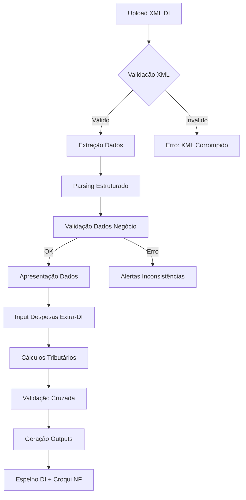
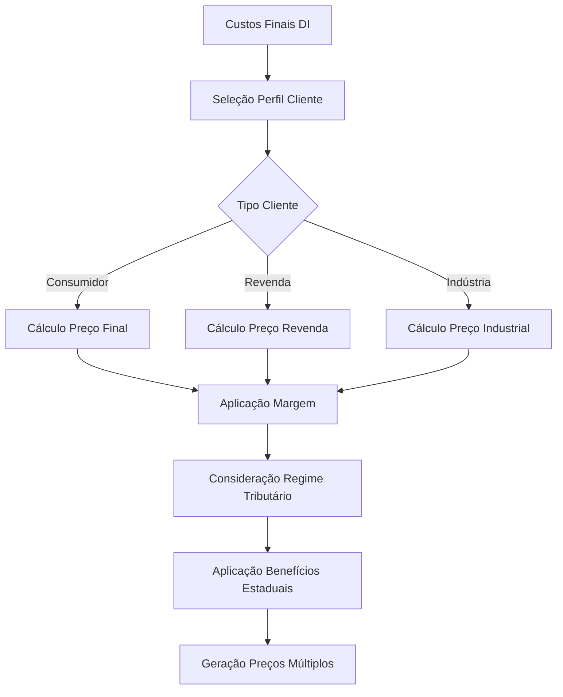

# Workflow e Estrutura Técnica do Sistema
## Sistema de Importação e Precificação Expertzy

### Especificação Técnica Detalhada
**Versão:** 1.0  
**Data:** Agosto 2025  
**Arquiteto:** Engenharia Expertzy

---

## 1. Arquitetura Tecnológica Recomendada

### 1.1 Stack Tecnológico Principal

**Backend:** Python 3.11+ com FastAPI  
**Frontend:** React.js 18+ com TypeScript  
**Banco de Dados:** PostgreSQL 15+ com Redis para cache  
**Containerização:** Docker com orquestração via Docker Compose  
**Web Server:** Nginx como proxy reverso e servidor de arquivos estáticos

A escolha do Python como linguagem principal fundamenta-se em sua robustez para processamento de dados complexos, disponibilidade de bibliotecas especializadas em manipulação de XML (lxml, xmltodict), processamento de Excel (openpyxl, pandas) e cálculos matemáticos precisos (decimal, numpy). O FastAPI oferece performance superior ao Flask tradicional e documentação automática de APIs através do padrão OpenAPI.

React.js com TypeScript no frontend garante interface moderna e type-safe, reduzindo erros de desenvolvimento e melhorando maintainability. A combinação com bibliotecas como Material-UI ou Ant Design proporcionará componentes profissionais alinhados com a identidade visual da Expertzy.

### 1.2 Arquitetura de Microserviços

```
┌─────────────────┐    ┌─────────────────┐    ┌─────────────────┐
│   Frontend SPA  │    │  API Gateway    │    │  Load Balancer  │
│   (React.js)    │◄──►│   (FastAPI)     │◄──►│     (Nginx)     │
└─────────────────┘    └─────────────────┘    └─────────────────┘
                                │
                    ┌───────────┼───────────┐
                    │           │           │
            ┌───────▼────┐ ┌────▼─────┐ ┌──▼──────┐
            │DI Service  │ │Tax Calc  │ │Pricing  │
            │            │ │Service   │ │Service  │
            └───────┬────┘ └────┬─────┘ └──┬──────┘
                    │           │          │
            ┌───────▼───────────▼──────────▼───┐
            │         PostgreSQL               │
            │      + Redis Cache               │
            └─────────────────────────────────┘
```

**DI Service:** Responsável pelo processamento de XMLs de DI, validação de dados e extração de informações estruturadas.

**Tax Calculation Service:** Centraliza todos os cálculos tributários, mantendo bases de dados fiscais atualizadas e aplicando regras complexas de tributação.

**Pricing Service:** Gerencia lógicas de precificação dinâmica, considerando diferentes perfis de clientes e cenários tributários.

## 2. Workflow Operacional Detalhado

### 2.1 Fluxo de Importação de DI



#### 2.1.1 Processamento de XML

O sistema implementará parser robusto baseado na biblioteca lxml que processa XMLs de DI considerando diferentes versões e schemas do Siscomex. O processamento incluirá:

**Validação de Estrutura:** Verificação de integridade do XML, validação contra schemas XSD quando disponíveis e identificação de elementos obrigatórios faltantes.

**Extração de Dados:** Mapeamento automático de elementos XML para estruturas de dados Python, com tratamento especial para arrays de adições e itens. Conversão automática de tipos de dados (datas, valores monetários, códigos NCM).

**Normalização:** Padronização de formatos de data, conversão de valores para tipos decimal para garantir precisão matemática, e normalização de códigos NCM para formato padrão de 8 dígitos.

#### 2.1.2 Estrutura de Dados da DI

```python
@dataclass
class DIData:
    numero_di: str
    data_registro: datetime
    importador: ImportadorData
    adicoes: List[AdicaoData]
    resumo_tributario: ResumoTributario
    despesas_extra_di: List[DespesaExtraDI]

@dataclass
class AdicaoData:
    numero_adicao: int
    itens: List[ItemData]
    valor_total_adicao: Decimal
    peso_liquido_adicao: Decimal
    
@dataclass
class ItemData:
    codigo_item: int
    descricao_produto: str
    ncm: str
    quantidade: Decimal
    unidade_medida: str
    valor_unitario_cfr: Decimal
    peso_liquido_item: Decimal
    impostos: ImpostosItem
```

### 2.2 Fluxo de Cálculos Tributários


#### 2.2.1 Engine de Cálculos

O motor de cálculos implementará regras tributárias brasileiras com precisão absoluta, utilizando bibliotecas Decimal para evitar erros de arredondamento em operações financeiras. As principais funcionalidades incluem:

**Cálculo de Impostos Federais:** Implementação completa das regras de II, IPI, PIS e COFINS, considerando regimes cumulativos e não-cumulativos, reduções de alíquota e tratamentos especiais por NCM.

**Cálculo de ICMS:** Aplicação de alíquotas estaduais diferenciadas, consideração de reduções de base, aplicação de benefícios fiscais específicos e cálculo de substituição tributária quando aplicável.

**Tratamento de Despesas Extra-DI:** Categorização automática de despesas, determinação de inclusão ou exclusão da base de cálculo do ICMS e documentação completa para fins de auditoria.

```python
class TaxCalculationEngine:
    def calculate_federal_taxes(self, item: ItemData, adicao: AdicaoData) -> FederalTaxes:
        """Calcula II, IPI, PIS, COFINS para um item específico"""
        
    def calculate_icms(self, item: ItemData, estado_destino: str, 
                      beneficios: List[BeneficioFiscal]) -> ICMSCalculation:
        """Calcula ICMS considerando estado de destino e benefícios"""
        
    def calculate_substitution_tax(self, item: ItemData, 
                                 estado_destino: str) -> SubstitutionTax:
        """Calcula ICMS-ST quando aplicável"""
```

### 2.3 Fluxo de Precificação



#### 2.3.1 Engine de Precificação

O módulo de precificação aplicará lógicas diferenciadas conforme perfil do cliente e características tributárias da operação:

**Precificação para Consumidor Final:** Considera carga tributária total na saída, incluindo ICMS na alíquota cheia, IPI quando aplicável, substituição tributária e margem comercial configurada.

**Precificação para Revenda:** Ajusta cálculos considerando aproveitamento de créditos pelo adquirente, focalizando em margem comercial e custos operacionais específicos.

**Precificação Industrial:** Aplica tratamentos especiais para operações B2B, considerando aproveitamento integral de créditos e natureza específica da operação.

```python
class PricingEngine:
    def calculate_consumer_price(self, cost_data: CostData, 
                               customer_state: str, margin: Decimal) -> ConsumerPrice:
        """Calcula preço para consumidor final"""
        
    def calculate_resale_price(self, cost_data: CostData, 
                              customer_state: str, margin: Decimal) -> ResalePrice:
        """Calcula preço para revenda"""
        
    def calculate_industrial_price(self, cost_data: CostData, 
                                 customer_state: str, margin: Decimal) -> IndustrialPrice:
        """Calcula preço para indústria"""
```

## 3. Estrutura de Base de Dados

### 3.1 Schema Principal

```sql
-- Tabela principal de DIs processadas
CREATE TABLE di_importacao (
    id SERIAL PRIMARY KEY,
    numero_di VARCHAR(20) UNIQUE NOT NULL,
    data_registro TIMESTAMP NOT NULL,
    data_processamento TIMESTAMP DEFAULT NOW(),
    importador_cnpj VARCHAR(14) NOT NULL,
    status_processamento VARCHAR(20) DEFAULT 'PROCESSANDO',
    xml_original TEXT,
    dados_estruturados JSONB,
    created_at TIMESTAMP DEFAULT NOW(),
    updated_at TIMESTAMP DEFAULT NOW()
);

-- Tabela de adições da DI
CREATE TABLE di_adicoes (
    id SERIAL PRIMARY KEY,
    di_id INTEGER REFERENCES di_importacao(id),
    numero_adicao INTEGER NOT NULL,
    valor_adicao DECIMAL(15,2),
    peso_liquido DECIMAL(10,3),
    dados_adicao JSONB,
    created_at TIMESTAMP DEFAULT NOW()
);

-- Tabela de itens por adição
CREATE TABLE di_itens (
    id SERIAL PRIMARY KEY,
    adicao_id INTEGER REFERENCES di_adicoes(id),
    codigo_item INTEGER NOT NULL,
    descricao TEXT,
    ncm VARCHAR(8) NOT NULL,
    quantidade DECIMAL(12,4),
    unidade_medida VARCHAR(10),
    valor_unitario DECIMAL(12,4),
    peso_liquido DECIMAL(10,3),
    impostos_calculados JSONB,
    created_at TIMESTAMP DEFAULT NOW()
);
```

### 3.2 Tabelas de Configuração Fiscal

```sql
-- Base de NCMs e alíquotas
CREATE TABLE ncm_impostos (
    ncm VARCHAR(8) PRIMARY KEY,
    descricao TEXT,
    aliquota_ii DECIMAL(5,4),
    aliquota_ipi DECIMAL(5,4),
    aliquota_pis DECIMAL(5,4),
    aliquota_cofins DECIMAL(5,4),
    regime_tributario VARCHAR(20),
    vigencia_inicio DATE,
    vigencia_fim DATE,
    updated_at TIMESTAMP DEFAULT NOW()
);

-- Alíquotas de ICMS por estado e NCM
CREATE TABLE icms_aliquotas (
    id SERIAL PRIMARY KEY,
    estado VARCHAR(2) NOT NULL,
    ncm VARCHAR(8) NOT NULL,
    aliquota_interna DECIMAL(5,4),
    aliquota_interestadual DECIMAL(5,4),
    reducao_base DECIMAL(5,4) DEFAULT 0,
    vigencia_inicio DATE,
    vigencia_fim DATE,
    UNIQUE(estado, ncm, vigencia_inicio)
);

-- Benefícios fiscais por estado
CREATE TABLE beneficios_fiscais (
    id SERIAL PRIMARY KEY,
    estado VARCHAR(2) NOT NULL,
    programa VARCHAR(50) NOT NULL,
    ncm_aplicavel VARCHAR(8),
    percentual_reducao DECIMAL(5,4),
    condicoes_aplicacao JSONB,
    base_legal TEXT,
    vigencia_inicio DATE,
    vigencia_fim DATE
);
```

## 4. APIs e Endpoints

### 4.1 API de Processamento de DI

```python
from fastapi import FastAPI, UploadFile, File
from typing import List

app = FastAPI(title="Expertzy Import System", version="1.0.0")

@app.post("/api/v1/di/upload")
async def upload_di_xml(file: UploadFile = File(...)):
    """Upload e processamento inicial de XML de DI"""
    
@app.get("/api/v1/di/{di_id}")
async def get_di_details(di_id: int):
    """Recupera detalhes completos de uma DI processada"""
    
@app.post("/api/v1/di/{di_id}/despesas-extra")
async def add_extra_expenses(di_id: int, despesas: List[DespesaExtraDI]):
    """Adiciona despesas extra-DI"""
    
@app.post("/api/v1/di/{di_id}/calculate")
async def calculate_taxes(di_id: int):
    """Executa cálculos tributários completos"""
    
@app.get("/api/v1/di/{di_id}/reports")
async def generate_reports(di_id: int, format: str = "pdf"):
    """Gera espelho DI e croqui NF"""
```

### 4.2 API de Precificação

```python
@app.post("/api/v1/pricing/calculate")
async def calculate_pricing(pricing_request: PricingRequest):
    """Calcula preços para diferentes perfis de cliente"""
    
@app.get("/api/v1/pricing/scenarios/{di_id}")
async def get_pricing_scenarios(di_id: int, customer_type: str, state: str):
    """Recupera cenários de precificação pré-calculados"""
    
@app.post("/api/v1/pricing/bulk-calculate")
async def bulk_pricing_calculation(items: List[ItemPricing]):
    """Cálculo em lote para múltiplos itens"""
```

### 4.3 APIs de Configuração

```python
@app.get("/api/v1/config/ncm/{ncm}")
async def get_ncm_config(ncm: str):
    """Recupera configurações tributárias de um NCM"""
    
@app.get("/api/v1/config/states/{state}/benefits")
async def get_state_benefits(state: str):
    """Lista benefícios fiscais disponíveis por estado"""
    
@app.post("/api/v1/config/tax-tables/update")
async def update_tax_tables():
    """Atualiza tabelas tributárias com dados oficiais"""
```

## 5. Componentes Frontend

### 5.1 Estrutura de Componentes React

```typescript
// Componente principal da aplicação
const App: React.FC = () => {
  return (
    <Router>
      <Layout>
        <Routes>
          <Route path="/" element={<Dashboard />} />
          <Route path="/di/upload" element={<DIUpload />} />
          <Route path="/di/:id" element={<DIDetails />} />
          <Route path="/pricing/:id" element={<PricingModule />} />
          <Route path="/reports/:id" element={<ReportsGeneration />} />
        </Routes>
      </Layout>
    </Router>
  );
};

// Componente de upload de DI
const DIUpload: React.FC = () => {
  const [file, setFile] = useState<File | null>(null);
  const [processing, setProcessing] = useState(false);
  
  const handleUpload = async () => {
    // Lógica de upload e processamento
  };
  
  return (
    <UploadContainer>
      <FileDropzone onFileSelect={setFile} />
      <ProcessingStatus isProcessing={processing} />
    </UploadContainer>
  );
};

// Componente de visualização de DI
const DIDetails: React.FC = () => {
  const { id } = useParams();
  const [diData, setDIData] = useState<DIData | null>(null);
  
  return (
    <DIContainer>
      <DIHeader data={diData} />
      <ExpandableTable 
        data={diData?.adicoes} 
        onItemExpand={handleItemExpand}
      />
      <ExtraCostsForm onSubmit={handleExtraCosts} />
      <CalculationResults results={diData?.calculations} />
    </DIContainer>
  );
};
```

### 5.2 Componentes Especializados

```typescript
// Tabela expansível para visualização de adições
interface ExpandableTableProps {
  data: AdicaoData[];
  onItemExpand: (itemId: string) => void;
}

const ExpandableTable: React.FC<ExpandableTableProps> = ({ data, onItemExpand }) => {
  return (
    <Table>
      <TableHeader>
        <TableRow>
          <TableCell>Adição</TableCell>
          <TableCell>Item</TableCell>
          <TableCell>Produto</TableCell>
          <TableCell>NCM</TableCell>
          <TableCell>Peso</TableCell>
          <TableCell>Quantidade</TableCell>
          <TableCell>Valor CFR</TableCell>
          <TableCell>Impostos</TableCell>
        </TableRow>
      </TableHeader>
      <TableBody>
        {data.map(adicao => (
          <ExpandableRow 
            key={adicao.numero_adicao}
            data={adicao}
            onExpand={onItemExpand}
          />
        ))}
      </TableBody>
    </Table>
  );
};

// Módulo de precificação
const PricingModule: React.FC = () => {
  const [pricingParams, setPricingParams] = useState<PricingParams>();
  const [scenarios, setScenarios] = useState<PricingScenario[]>([]);
  
  return (
    <PricingContainer>
      <PricingParametersForm 
        onParamsChange={setPricingParams}
      />
      <ScenarioComparison scenarios={scenarios} />
      <PricingResults 
        scenarios={scenarios}
        onExport={handleExport}
      />
    </PricingContainer>
  );
};
```

## 6. Segurança e Autenticação

### 6.1 Sistema de Autenticação

```python
from fastapi_users import FastAPIUsers
from fastapi_users.authentication import JWTAuthentication

# Configuração de autenticação JWT
SECRET = "your-secret-key"
jwt_authentication = JWTAuthentication(secret=SECRET, lifetime_seconds=3600)

# Middleware de autorização
@app.middleware("http")
async def authorization_middleware(request: Request, call_next):
    # Verificação de token JWT
    # Controle de acesso baseado em perfis
    pass

# Controle de acesso por endpoint
@app.post("/api/v1/di/upload")
@requires_permission("di:create")
async def upload_di_xml(file: UploadFile = File(...)):
    pass
```

### 6.2 Auditoria e Logging

```python
import logging
from datetime import datetime

class AuditLogger:
    def __init__(self):
        self.logger = logging.getLogger("audit")
        
    def log_di_processing(self, user_id: str, di_number: str, action: str):
        """Log de ações de processamento de DI"""
        self.logger.info({
            "timestamp": datetime.now().isoformat(),
            "user_id": user_id,
            "di_number": di_number,
            "action": action,
            "ip_address": request.client.host
        })
        
    def log_calculation_change(self, user_id: str, di_id: int, 
                             old_value: dict, new_value: dict):
        """Log de mudanças em cálculos"""
        pass
```

## 7. Deploy e DevOps

### 7.1 Containerização

```dockerfile
# Dockerfile para backend
FROM python:3.11-slim

WORKDIR /app

COPY requirements.txt .
RUN pip install -r requirements.txt

COPY . .

EXPOSE 8000

CMD ["uvicorn", "main:app", "--host", "0.0.0.0", "--port", "8000"]
```

```yaml
# docker-compose.yml
version: '3.8'

services:
  backend:
    build: ./backend
    ports:
      - "8000:8000"
    environment:
      - DATABASE_URL=postgresql://user:pass@db:5432/expertzy
      - REDIS_URL=redis://redis:6379
    depends_on:
      - db
      - redis
      
  frontend:
    build: ./frontend
    ports:
      - "3000:3000"
    depends_on:
      - backend
      
  db:
    image: postgres:15
    environment:
      POSTGRES_DB: expertzy
      POSTGRES_USER: user
      POSTGRES_PASSWORD: pass
    volumes:
      - postgres_data:/var/lib/postgresql/data
      
  redis:
    image: redis:7-alpine
    ports:
      - "6379:6379"

volumes:
  postgres_data:
```

### 7.2 CI/CD Pipeline

```yaml
# .github/workflows/deploy.yml
name: Deploy to Production

on:
  push:
    branches: [ main ]

jobs:
  test:
    runs-on: ubuntu-latest
    steps:
      - uses: actions/checkout@v3
      - name: Run Tests
        run: |
          python -m pytest tests/
          npm test
          
  deploy:
    needs: test
    runs-on: ubuntu-latest
    steps:
      - name: Deploy to Production
        run: |
          docker-compose -f docker-compose.prod.yml up -d
```

---

**Conclusão Técnica**

Esta especificação técnica fornece roadmap completo para implementação do Sistema de Importação e Precificação da Expertzy, definindo arquitetura robusta, escalável e maintível que atenderá às necessidades complexas de processamento tributário especializado. A combinação de tecnologias modernas com design cuidadoso de APIs e interfaces garantirá solução profissional que elevará significativamente a capacidade operacional da consultoria.

A implementação seguindo estas especificações resultará em sistema diferenciado no mercado, combinando expertise tributária da Expertzy com excelência técnica em desenvolvimento de software, estabelecendo novo padrão para soluções tecnológicas no segmento de consultoria fiscal especializada.